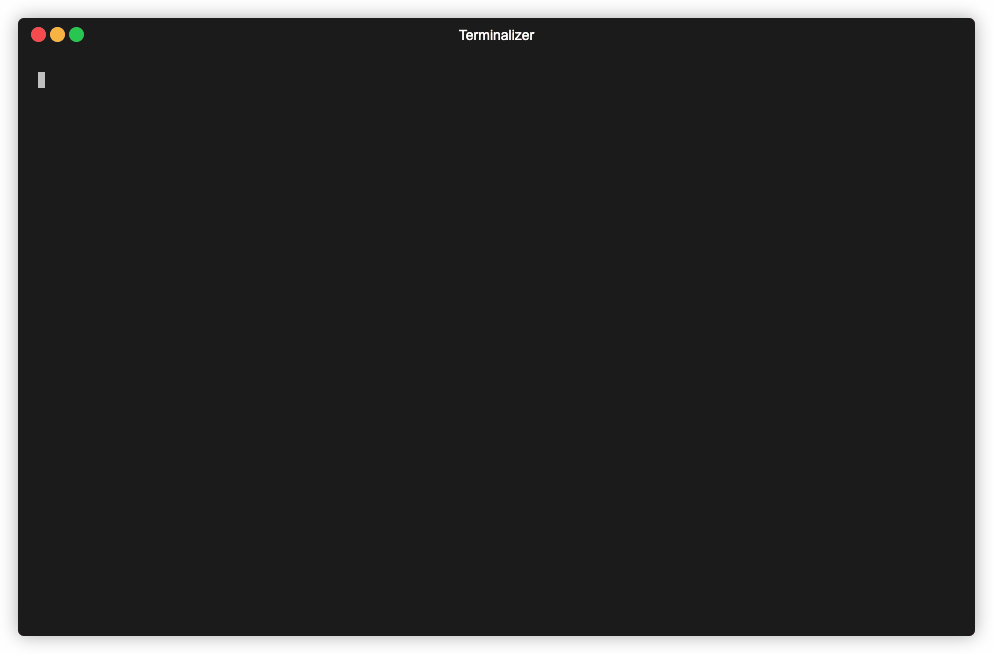

# 百度千帆大模型平台 SDK

[](https://github.com/baidubce/bce-qianfan-sdk/blob/master/LICENSE)
[](https://qianfan.readthedocs.io/en/stable/README.html)
[](https://github.com/baidubce/bce-qianfan-sdk/issues)
[](https://console.bce.baidu.com/ticket/#/ticket/create?productId=279)
<br>
[](https://github.com/baidubce/bce-qianfan-sdk/releases)
[](https://pypi.org/project/qianfan/)

<br>
[](https://github.com/baidubce/bce-qianfan-sdk/releases)
[](https://pkg.go.dev/github.com/baidubce/bce-qianfan-sdk/go/qianfan)

<br>
[![Java Release](https://img.shields.io/github/v/release/baidubce/bce-qianfan-sdk?filter=Java%2F*&label=release&logo=data:image/svg+xml;base64,PHN2ZyByb2xlPSJpbWciIHZpZXdCb3g9IjAgMCAyNCAyNCIgZmlsbD0id2hpdGUiIHhtbG5zPSJodHRwOi8vd3d3LnczLm9yZy8yMDAwL3N2ZyI+PHRpdGxlPkphdmE8L3RpdGxlPjxwYXRoIGQ9Ik04Ljg1MSAxOC41NnMtLjkxNy41MzQuNjUzLjcxNGMxLjkwMi4yMTggMi44NzQuMTg3IDQuOTY5LS4yMTEgMCAwIC41NTIuMzQ2IDEuMzIxLjY0Ni00LjY5OSAyLjAxMy0xMC42MzMtLjExOC02Ljk0My0xLjE0OU04LjI3NiAxNS45MzNzLTEuMDI4Ljc2MS41NDIuOTI0YzIuMDMyLjIwOSAzLjYzNi4yMjcgNi40MTMtLjMwOCAwIDAgLjM4NC4zODkuOTg3LjYwMi01LjY3OSAxLjY2MS0xMi4wMDcuMTMtNy45NDItMS4yMThNMTMuMTE2IDExLjQ3NWMxLjE1OCAxLjMzMy0uMzA0IDIuNTMzLS4zMDQgMi41MzNzMi45MzktMS41MTggMS41ODktMy40MThjLTEuMjYxLTEuNzcyLTIuMjI4LTIuNjUyIDMuMDA3LTUuNjg4IDAtLjAwMS04LjIxNiAyLjA1MS00LjI5MiA2LjU3M00xOS4zMyAyMC41MDRzLjY3OS41NTktLjc0Ny45OTFjLTIuNzEyLjgyMi0xMS4yODggMS4wNjktMTMuNjY5LjAzMy0uODU2LS4zNzMuNzUtLjg5IDEuMjU0LS45OTguNTI3LS4xMTQuODI4LS4wOTMuODI4LS4wOTMtLjk1My0uNjcxLTYuMTU2IDEuMzE3LTIuNjQzIDEuODg3IDkuNTggMS41NTMgMTcuNDYyLS43IDE0Ljk3Ny0xLjgyTTkuMjkyIDEzLjIxcy00LjM2MiAxLjAzNi0xLjU0NCAxLjQxMmMxLjE4OS4xNTkgMy41NjEuMTIzIDUuNzctLjA2MiAxLjgwNi0uMTUyIDMuNjE4LS40NzcgMy42MTgtLjQ3N3MtLjYzNy4yNzItMS4wOTguNTg3Yy00LjQyOSAxLjE2NS0xMi45ODYuNjIzLTEwLjUyMi0uNTY4IDIuMDgyLTEuMDA2IDMuNzc2LS44OTIgMy43NzYtLjg5Mk0xNy4xMTYgMTcuNTg0YzQuNTAzLTIuMzQgMi40MjEtNC41ODkuOTY4LTQuMjg1LS4zNTUuMDc0LS41MTUuMTM4LS41MTUuMTM4cy4xMzItLjIwNy4zODUtLjI5N2MyLjg3NS0xLjAxMSA1LjA4NiAyLjk4MS0uOTI4IDQuNTYyIDAtLjAwMS4wNy0uMDYyLjA5LS4xMThNMTQuNDAxIDBzMi40OTQgMi40OTQtMi4zNjUgNi4zM2MtMy44OTYgMy4wNzctLjg4OCA0LjgzMi0uMDAxIDYuODM2LTIuMjc0LTIuMDUzLTMuOTQzLTMuODU4LTIuODI0LTUuNTM5IDEuNjQ0LTIuNDY5IDYuMTk3LTMuNjY1IDUuMTktNy42MjdNOS43MzQgMjMuOTI0YzQuMzIyLjI3NyAxMC45NTktLjE1MyAxMS4xMTYtMi4xOTggMCAwLS4zMDIuNzc1LTMuNTcyIDEuMzkxLTMuNjg4LjY5NC04LjIzOS42MTMtMTAuOTM3LjE2OCAwLS4wMDEuNTUzLjQ1NyAzLjM5My42MzkiLz48L3N2Zz4=)](https://github.com/baidubce/bce-qianfan-sdk/releases)
[](https://mvnrepository.com/artifact/com.baidubce/qianfan)
![Java Version](https://img.shields.io/badge/version-v8%2B-brightgreen?logo=data%3Aimage%2Fsvg%2Bxml%3Bbase64%2CPHN2ZyByb2xlPSJpbWciIHZpZXdCb3g9IjAgMCAyNCAyNCIgZmlsbD0id2hpdGUiIHhtbG5zPSJodHRwOi8vd3d3LnczLm9yZy8yMDAwL3N2ZyI%2BPHRpdGxlPkphdmE8L3RpdGxlPjxwYXRoIGQ9Ik04Ljg1MSAxOC41NnMtLjkxNy41MzQuNjUzLjcxNGMxLjkwMi4yMTggMi44NzQuMTg3IDQuOTY5LS4yMTEgMCAwIC41NTIuMzQ2IDEuMzIxLjY0Ni00LjY5OSAyLjAxMy0xMC42MzMtLjExOC02Ljk0My0xLjE0OU04LjI3NiAxNS45MzNzLTEuMDI4Ljc2MS41NDIuOTI0YzIuMDMyLjIwOSAzLjYzNi4yMjcgNi40MTMtLjMwOCAwIDAgLjM4NC4zODkuOTg3LjYwMi01LjY3OSAxLjY2MS0xMi4wMDcuMTMtNy45NDItMS4yMThNMTMuMTE2IDExLjQ3NWMxLjE1OCAxLjMzMy0uMzA0IDIuNTMzLS4zMDQgMi41MzNzMi45MzktMS41MTggMS41ODktMy40MThjLTEuMjYxLTEuNzcyLTIuMjI4LTIuNjUyIDMuMDA3LTUuNjg4IDAtLjAwMS04LjIxNiAyLjA1MS00LjI5MiA2LjU3M00xOS4zMyAyMC41MDRzLjY3OS41NTktLjc0Ny45OTFjLTIuNzEyLjgyMi0xMS4yODggMS4wNjktMTMuNjY5LjAzMy0uODU2LS4zNzMuNzUtLjg5IDEuMjU0LS45OTguNTI3LS4xMTQuODI4LS4wOTMuODI4LS4wOTMtLjk1My0uNjcxLTYuMTU2IDEuMzE3LTIuNjQzIDEuODg3IDkuNTggMS41NTMgMTcuNDYyLS43IDE0Ljk3Ny0xLjgyTTkuMjkyIDEzLjIxcy00LjM2MiAxLjAzNi0xLjU0NCAxLjQxMmMxLjE4OS4xNTkgMy41NjEuMTIzIDUuNzctLjA2MiAxLjgwNi0uMTUyIDMuNjE4LS40NzcgMy42MTgtLjQ3N3MtLjYzNy4yNzItMS4wOTguNTg3Yy00LjQyOSAxLjE2NS0xMi45ODYuNjIzLTEwLjUyMi0uNTY4IDIuMDgyLTEuMDA2IDMuNzc2LS44OTIgMy43NzYtLjg5Mk0xNy4xMTYgMTcuNTg0YzQuNTAzLTIuMzQgMi40MjEtNC41ODkuOTY4LTQuMjg1LS4zNTUuMDc0LS41MTUuMTM4LS41MTUuMTM4cy4xMzItLjIwNy4zODUtLjI5N2MyLjg3NS0xLjAxMSA1LjA4NiAyLjk4MS0uOTI4IDQuNTYyIDAtLjAwMS4wNy0uMDYyLjA5LS4xMThNMTQuNDAxIDBzMi40OTQgMi40OTQtMi4zNjUgNi4zM2MtMy44OTYgMy4wNzctLjg4OCA0LjgzMi0uMDAxIDYuODM2LTIuMjc0LTIuMDUzLTMuOTQzLTMuODU4LTIuODI0LTUuNTM5IDEuNjQ0LTIuNDY5IDYuMTk3LTMuNjY1IDUuMTktNy42MjdNOS43MzQgMjMuOTI0YzQuMzIyLjI3NyAxMC45NTktLjE1MyAxMS4xMTYtMi4xOTggMCAwLS4zMDIuNzc1LTMuNTcyIDEuMzkxLTMuNjg4LjY5NC04LjIzOS42MTMtMTAuOTM3LjE2OCAwLS4wMDEuNTUzLjQ1NyAzLjM5My42MzkiLz48L3N2Zz4%3D)
<br>
[](https://github.com/baidubce/bce-qianfan-sdk/releases)
[](https://www.npmjs.com/package/@baiducloud/qianfan)


## 简介


千帆 SDK 提供大模型工具链最佳实践，让 AI 工作流和 AI 原生应用优雅且便捷地访问千帆大模型平台。SDK 核心能力包含三大部分：大模型推理，大模型训练，以及通用和扩展:

- `大模型推理`：实现了对一言（ERNIE）系列、开源大模型等模型推理的接口封装，支持对话、补全、Embedding 等。
- `大模型训练`：基于平台能力支持端到端的大模型训练过程，包括训练数据，精调/预训练，以及模型托管等。
- `通用与扩展`：通用能力包括了 Prompt/Debug/Client 等常见的 AI 开发工具。扩展能力则基于千帆特性适配常见的中间层框架。

## 如何安装

目前千帆Python SDK 已发布到 PyPI ，用户可使用 pip 命令进行安装，Python需要 3.7.0 或更高的版本。

```
pip install 'qianfan[dataset_base]'
```

在安装完成后，用户可以参考 [文档](./docs/cli.md) 在命令行中快速使用千帆平台功能，或者在代码内引入千帆 SDK 并使用

```python
import qianfan
```

更多安装选项见[文档](./docs/install.md)

## 多语言SDK

其它语言见如下文档：

+ [Go](https://github.com/baidubce/bce-qianfan-sdk/tree/main/go)
+ [Java](https://github.com/baidubce/bce-qianfan-sdk/tree/main/java)
+ [JavaScript](https://github.com/baidubce/bce-qianfan-sdk/tree/main/javascript)

## 快速使用

在使用千帆 SDK 之前，用户需要 [百度智能云控制台 - 安全认证](https://console.bce.baidu.com/iam/#/iam/accesslist) 页面获取 Access Key 与 Secret Key，具体流程参见平台 [说明文档](https://cloud.baidu.com/doc/Reference/s/9jwvz2egb)。在获得了 Access Key 与 Secret Key 后，用户即可开始使用 SDK：

```python
import os
import qianfan

os.environ["QIANFAN_ACCESS_KEY"] = "..."
os.environ["QIANFAN_SECRET_KEY"] = "..."

# 接下来就可以调用 SDK 的所有功能
chat = qianfan.ChatCompletion()
resp = chat.do(messages=[{"role": "user", "content": "你好，千帆"}])

print(resp["result"])
```

除了通过环境变量设置外，千帆 SDK 还提供了通过 DotEnv 加载 `.env` 文件和通过代码配置的方式，详细参见 [SDK 配置](./docs/configurable.md) 部分。

<details>
<summary> （方案二）通过应用接入进行鉴权 </summary>

<br>

> 这里是一些其他认证方式，请仅在无法获取 Access Key 与 Secret Key 时使用。这些认证方式已经过时，将在未来从 SDK 中移除。

API Key (**AK**) 和 Secret Key (**SK**) 是用户在调用千帆模型相关功能时所需要的凭证。具体获取流程参见平台的[应用接入使用说明文档](https://cloud.baidu.com/doc/WENXINWORKSHOP/s/Slkkydake)，但该认证方式无法使用训练、发布模型等功能，若需使用请使用 Access Key 和 Secret Key 的方式进行认证。在获得并配置了 AK 以及 SK 后，用户即可开始使用 SDK：

```python
import os
import qianfan

os.environ["QIANFAN_AK"] = "..."
os.environ["QIANFAN_SK"] = "..."

# 只可以调用模型推理相关功能
chat = qianfan.ChatCompletion()
resp = chat.do(messages=[{"role": "user", "content": "你好，千帆"}])

print(resp["result"])
```

适用范围：

| 功能 | API Key | Access Key |
|:---|:---:|:---:|
| Chat 对话 | ✅ | ✅ |
| Completion 续写 | ✅ | ✅ |
| Embedding 向量化 | ✅ | ✅ |
| Plugin 插件调用 | ✅ | ✅ |
| 文生图 | ✅ | ✅ |
| 大模型调优 | ❌ | ✅ |
| 大模型管理 | ❌ | ✅ |
| 大模型服务 | ❌ | ✅ |
| 数据集管理 | ❌ | ✅ |

</details>

## 功能导览

我们提供了数个 [cookbook](https://github.com/baidubce/bce-qianfan-sdk/blob/main/cookbook/README.md)，可以快速了解如何使用 SDK 以及与第三方组件进行交互。

### 大模型推理

目前千帆 SDK 支持用户使用如下大模型预测能力

+ Chat 对话
+ Completion 续写
+ Embedding 向量化
+ Plugin 插件调用
+ Text2Image 文生图
+ Image2Text 图生文
+ Reranker 重排序

如下是使用千帆 SDK 调用 Chat 对话的例子，同时 SDK 还支持异步、流式调用和批量推理，详见 [推理服务](./docs/inference.md)

```python
import os
import qianfan

# 动态获取最新模型列表依赖 IAM Access Key 进行鉴权，使用应用 AK 鉴权时不支持该功能
os.environ["QIANFAN_ACCESS_KEY"] = "..."
os.environ["QIANFAN_SECRET_KEY"] = "..."

# 模型名称可以通过 qianfan.ChatCompletion.models() 获取
# 也可以在命令行运行 qianfan chat --list-model 查看
chat_comp = qianfan.ChatCompletion(model="ERNIE-3.5-8K")
resp = chat_comp.do(
    messages=[{"role": "user", "content": "你好，千帆"}],
    # （可选）设置模型参数，与 API 参数一致
    top_p=0.8,
    temperature=0.9,
    penalty_score=1.0,
)

print(resp["result"])
```

### 大模型训练

在预置模型无法满足业务场景时，可使用大模型精调和预训练接口，来定制专属大模型。大致流程可分为：准备数据(Dataset) -> 训练(Trainer) -> 模型评估(Evaluation) -> 服务(Service)；

#### Dataset

用户可以在本地通过千帆 Python SDK 提供的接口，加载平台的数据集并用于后续的训练流程

```python
from qianfan.dataset import Dataset

ds = Dataset.load(qianfan_dataset_id="your_dataset_id")
```

且千帆 Python SDK 集成了一系列本地的数据处理功能，允许用户在本地对来自多个数据源的数据进行增删改查等操作，详见[Dataset 框架](./docs/dataset.md)。

以下是一个通过加载本地数据集、处理并上传到千帆的例子。所有数据集在本地处理前都必须先通过 `load` 或 `save` 方法加载到本地。

假设我们有以下格式的 Json 数据集：

```json
[
  {"question": "...", "answer":  "..."},
  {"question": "...", "answer":  "..."},
  {"question": "..."}
]
```

```python
from typing import Dict, Any

from qianfan.dataset import Dataset

# 从本地文件导入
ds = Dataset.load(data_file="path/to/dataset_file.json")

def filter_func(row: Dict[str, Any]) -> bool:
  return "answer" in row.keys()

def map_func(row: Dict[str, Any]) -> Dict[str, Any]:
  return {
      "prompt": row["question"],
      "response": row["answer"],
  }

# 链式调用处理数据
ds.filter(filter_func).map(map_func).pack()

# 上传到千帆
# 数据集只有上传到千帆后才可以用于训练
# 请确保你的数据集格式符合要求
ds.save(qianfan_dataset_id="your_dataset_id")
```

#### Trainer

千帆 Python SDK 以Pipeline为基础串联整个模型训练的流程，同时允许用户更好的把控训练流程状态 [Trainer 框架](./docs/trainer.md)。
以下是一个快速实现ERNIE-Speed-8K fine-tuning的例子：
```python
from qianfan.dataset import Dataset
from qianfan.trainer import Finetune

# 加载千帆平台上的数据集
ds: Dataset = Dataset.load(qianfan_dataset_id="ds-xxx")

# 新建trainer LLMFinetune，最少传入train_type和dataset
# 注意fine-tune任务需要指定的数据集类型要求为有标注的非排序对话数据集。
trainer = Finetune(
    train_type="ERNIE-Speed-8K",
    dataset=ds, 
)

trainer.run()

```

#### Model

千帆 Python SDK 对模型管理能力进行了抽象和封装，开发者可以通过[Model](./docs/trainer.md)模块进行模型相关的管理，和批量推理，评估等操作。

以下是一个基于模型实现批量推理的例子：

```python
from qianfan.model import Model
from qianfan.dataset import Dataset

ds = Dataset.load(qianfan_dataset_id="ds-xx")
m = Model(version_id="amv-xx")

m.batch_inference(dataset=ds)
```


### 通用与扩展

#### Prompt

SDK 支持对文生文、文生图等任务的 Prompt 进行管理、优化、评估等操作，详见[Prompt 管理](./docs/prompt.md)

#### Client

SDK 内置了一个命令行工具，能够在终端直接与千帆平台进行交互，例如与大模型对话、发起训练任务、预览数据集等等，详见 [命令行工具](./docs/cli.md)



### API Resources

平台API能力汇总，详见[**平台API能力**](./docs/api_contents.md)

### 其他
- [tokenizer](./docs/utils.md)
- [流量控制](./docs/configurable.md)

> Check [**API References**](https://qianfan.readthedocs.io/en/stable/qianfan.html) for more details.


## 联系我们
如使用过程中遇到什么问题，或对SDK功能有建议，可通过如下方式联系我们
- [GitHub issues](https://github.com/baidubce/bce-qianfan-sdk/issues)
- [百度智能云工单](https://console.bce.baidu.com/ticket/#/ticket/create?productId=279) （百度专家即时服务）
- 千帆SDK官方微信群


## License

Apache-2.0
