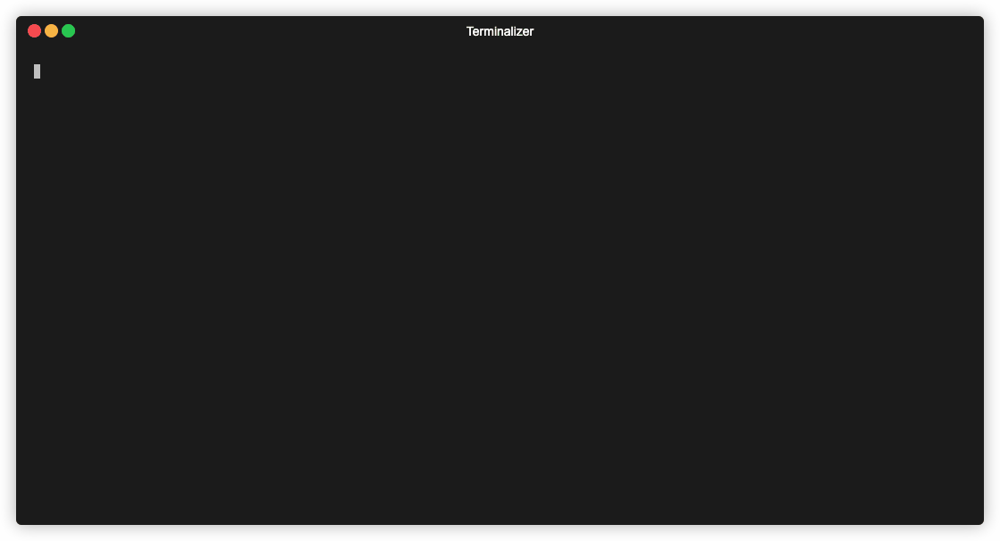
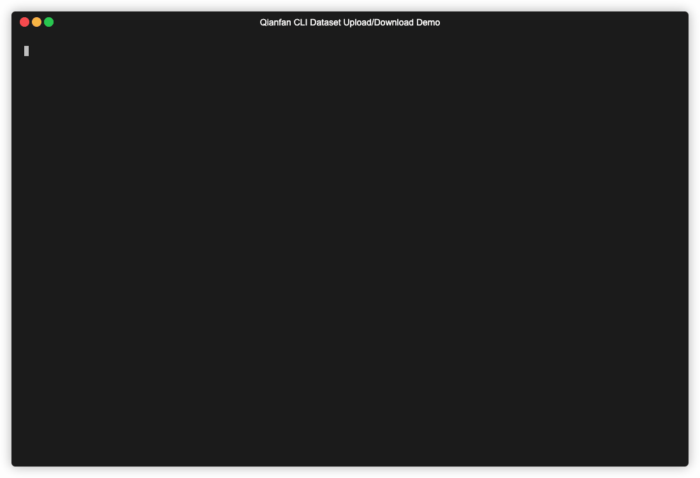

## CLI 命令行工具

千帆 SDK 提供了 CLI 工具，方便在命令行中直接使用千帆平台各项功能。

**使用方法**:

使用前需要配置鉴权相关信息，关于 Access Key 和 Secret Key 的获取方式参考 [文档](https://cloud.baidu.com/doc/Reference/s/9jwvz2egb)。除了使用环境变量，也可以通过下方命令行参数传递，或者是通过当前文件夹的 [.env 文件](https://github.com/baidubce/bce-qianfan-sdk/blob/main/dotenv_config_sample.env) 配置。

```console
$ export QIANFAN_ACCESS_KEY=your-access-key
$ export QIANFAN_SECRET_KEY=your-secret-key
$
$ qianfan [OPTIONS] COMMAND [ARGS]...
```

**基础参数**:

> **IMPORTANT**：以下参数必须位于 command 命令之前，否则会被识别成命令的参数而无法生效。

* `--access-key TEXT`：百度智能云安全认证 Access Key，获取方式参考 [文档](https://cloud.baidu.com/doc/Reference/s/9jwvz2egb)。
* `--secret-key TEXT`：百度智能云安全认证 Secret Key，获取方式参考 [文档](https://cloud.baidu.com/doc/Reference/s/9jwvz2egb)。
* `--ak TEXT` [过时]：千帆平台应用的 API Key，仅能用于模型推理部分 API，获取方式参考 [文档](https://cloud.baidu.com/doc/WENXINWORKSHOP/s/Slkkydake)。
* `--sk TEXT` [过时]：千帆平台应用的 Secret Key，仅能用于模型推理部分 API，获取方式参考 [文档](https://cloud.baidu.com/doc/WENXINWORKSHOP/s/Slkkydake)。
* `--enable-traceback`：打印完整的错误堆栈信息，仅在发生异常时有效。
* `--version -v`：打印版本信息。
* `--install-shell-autocomplete`：为当前 shell 安装自动补全脚本。
* `--show-shell-autocomplete`：展示自动补全脚本。
* `--help -h`：打印帮助文档。

**命令**:

* `chat` 对话
* `completion` 补全
* `txt2img` 文生图
* `plugin` 插件
* `dataset` 数据集
* `evalutaion` 评估
* `openai` OpenAI 接口模拟

### chat 对话


**用法**:

```console
$ qianfan chat [OPTIONS]
```

**Options 选项**:

* `--model TEXT`：模型名称  [default：ERNIE-Lite-8K]
* `--endpoint TEXT`：模型的 endpoint
* `--multi-line / --no-multi-line`：多行模式，提交时需要先按下 Esc 再回车，以避免与文本换行冲突  [default：no-multi-line]
* `--list-model -l`：打印支持的模型名称列表
* `--raw-output`：默认命令行会将输出以 Markdown 格式进行渲染，如果希望查看原始输出，可以开启该选项。
* `--debug`：调试模式，会打印请求相关的原始信息。
* `--help`：展示帮助文档

在对话进行过程中，可以通过输入命令实现如下功能：

* `/reset`：重置对话，清空对话历史
* `/exit`：结束对话
* `/help`：展示帮助信息

### completion 补全



**用法**:

```console
$ qianfan completion [OPTIONS] PROMPTS...
```

**Arguments 参数**:

* `PROMPTS...`：需要补全的 prompt，支持传递多个 prompt 以表示对话历史，依次表示用户和模型的消息，必须为奇数。如不传递则需要在命令行中交互输入。

**Options 选项**:

* `--model TEXT`：模型名称  [default：ERNIE-Lite-8K]
* `--endpoint TEXT`：模型的 endpoint
* `--plain / --no-plain`：普通文本模式，不使用富文本  [default：no-plain]
* `--list-model -l`：打印支持的模型名称列表
* `--multi-line`：多行模式，提交时需要先按下 Esc 再回车，以避免与文本换行冲突
* `--debug`：调试模式，会打印请求相关的原始信息。
* `--help`：展示帮助文档

### txt2img 文生图


**用法**:

```console
$ qianfan txt2img [OPTIONS] PROMPT
```

该命令依赖 [Pillow](https://pypi.org/project/Pillow/)，需要使用该功能的话可以通过 `pip install Pillow` 安装，具体参考 [Pillow 安装文档](https://pillow.readthedocs.io/en/latest/installation.html)。

**Arguments 参数**:

* `PROMPT`：生成图片的 prompt  [required]

**Options 选项**:

* `--negative-prompt TEXT`：生成图片的负向 prompt
* `--model TEXT`：使用的模型名称  [default：Stable-Diffusion-XL]
* `--endpoint TEXT`：使用的模型 endpoint
* `--output PATH`：输出的文件名称  [default：`%Y%m%d_%H%M%S.jpg`]
* `--plain / --no-plain`：普通文本模式，不使用富文本  [default：no-plain]
* `--list-model -l`：打印支持的模型名称列表
* `--debug`：调试模式，会打印请求相关的原始信息。
* `--help`：展示帮助文档

### plugin 插件

**用法**:

```console
$ qianfan plugin [OPTIONS]
```

**Options 选项**:

* `--endpoint TEXT`：千帆插件的 endpoint。如果未提供该参数，则使用一言插件。
* `--multi-line / --no-multi-line`：多行模式，提交时需要先按下 Esc 再回车，以避免与文本换行冲突  [default：no-multi-line]
* `--plugins`：启用的插件列表，通过 `,` 分隔不同的插件，例如 `uuid-zhishiku,uuid-chatocr,uuid-weatherforecast`
* `--debug`：调试模式，会打印请求相关的原始信息
* `--bos-path`：BOS 路径，用于上传文件
* `--help`：展示帮助文档

在对话进行过程中，可以通过输入命令实现如下功能：

* `/image [file_path]`：上传图片并附加至对话中，`file_path` 可以是网络上的链接，也可以是本地文件路径。其中，本地文件会被上传至 BOS 路径，因此需要提供 `bos-path` 参数。
* `/file [file_path]`：上传文件并附加至对话中，与 `/image` 使用方法相同。仅一言插件支持该命令。
* `/reset`：重置对话，清空对话历史
* `/exit`：结束对话
* `/help`：展示帮助信息

### dataset 数据集


**用法**:

```console
$ qianfan dataset [OPTIONS] COMMAND [ARGS]...
```

**Options 选项**:

* `--help`：展示帮助文档

**Commands 命令**:

* `predict`：调用大模型对数据集进行预测，并保存到本地文件。
* `download`：下载数据集。
* `upload`：上传数据集。
* `save`：保存数据集至本地文件或平台。
* `view`：预览数据集内容。

> ⚠️ 在下方各个数据集的命令中，涉及数据集 id 均指平台上的数据集版本 id，与 Dataset 模块定义一致，具体获取方式参考 [文档](https://cloud.baidu.com/doc/WENXINWORKSHOP/s/Uloic6krs)。
>
> 使用时可以直接传数据集的 id，也可以使用链接形式避免与文件名产生歧义，格式为 `qianfan://{dataset_version_id}`，例如 `qianfan://18562`。
>
> 如果由于本地文件名为数字，导致和数据集 id 混淆，可以在文件名前增加 `./` 避免歧义，例如 `./18562`。

#### predict 数据集预测

调用大模型对数据集进行预测，并保存到本地文件。

**用法**:

```console
$ qianfan dataset predict [OPTIONS] DATASET
```

**Arguments 参数**:

* `DATASET`：待预测的数据集。值可以是一个本地文件的路径，也可以是平台上的数据集链接 (格式为 `qianfan://{dataset_version_id}`)。  [required]

**Options 选项**:

* `--model TEXT`：预测用的模型名称，可以用 `qianfan chat --list-model` 获取模型列表。  [default：ERNIE-Lite-8K]
* `--endpoint TEXT`：预测用的模型 endpoint，该选项会覆盖 `--model` 选项。
* `--output PATH`：输出的文件路径。  [default：`%Y%m%d_%H%M%S.jsonl`]
* `--input-columns TEXT`：输入的列名称。  [default：prompt]
* `--reference-column TEXT`：参考答案的列名称。
* `--help`：展示帮助文档。

#### download 数据集下载

下载数据集至本地。



**用法**:

```console
$ qianfan dataset download [OPTIONS] DATASET_ID
```

**Arguments 参数**:

* `DATASET_ID`：待下载的数据集版本 id。 [required]

**Options 选项**:

* `--output TEXT`：输出的文件名称  [default：`%Y%m%d_%H%M%S.jpg`]
* `--help`：展示帮助文档。

#### upload 数据集上传

上传本地数据集文件至平台。

**用法**:

```console
$ qianfan dataset upload [OPTIONS] PATH [DST]
```

**Arguments 参数**:

* `SRC`：数据集文件路径。 [required]
* `[DST]`：目标数据集 id，该参数可选。如果不提供该值，那么将会在平台上创建一个新的数据集，否则数据将被追加至所提供的数据集中。值可以是数据集的 id 或者是千帆数据集链接 (qianfan://{dataset_version_id})。

**Options 选项**:

* `--dataset-name TEXT`：新建数据集的名称，仅在不提供 `DST` 参数时需要。
* `--dataset-template-type [non_sorted_conversation|sorted_conversation|generic_text|query_set|text2_image]`：数据集的类型，仅在不提供 `DST` 参数时需要。  [default：non_sorted_conversation]
* `--dataset-storage-type [public_bos|private_bos]`：数据集存储的类型，仅在不提供 `DST` 参数时需要。  [default：private_bos]
* `--bos-path TEXT`：数据集保存在 BOS 上的路径。 (e.g. bos://bucket/path/)  [required]
* `--help`：展示帮助文档。

#### save 数据集保存

保存数据集至本地文件或平台。

> `upload` 和 `download` 命令提供了更为方便的上传和下载数据集的方法，满足需求的前提下建议优先使用这两个命令。
> 
> `save` 命令提供了更为灵活的数据集保存功能，例如平台数据拷贝至另一个平台数据集中，可以满足更为复杂的需求。

**用法**:

```console
$ qianfan dataset save [OPTIONS] SRC [DST]
```

**Arguments 参数**:

* `SRC`：源数据集。值可以是一个本地文件的路径，也可以是平台上的数据集链接 (格式为 `qianfan://{dataset_version_id}`)。 [required]
* `[DST]`：目标数据集。如果值是一个本地文件路径，那么数据将保存至该文件中。或者可以提供一个已有的千帆数据集链接 (qianfan://{dataset_version_id})，那么数据将被追加至该数据集中。如果不提供该值，那么将会在平台上创建一个新的数据集，此时需要提供创建数据集所需的一些参数，具体见下文。

**Options 选项**:

* `--dataset-name TEXT`：新建数据集的名称，仅在不提供 `DST` 参数时需要。
* `--dataset-template-type [non_sorted_conversation|sorted_conversation|generic_text|query_set|text2_image]`：数据集的类型，仅在不提供 `DST` 参数时需要。  [default：non_sorted_conversation]
* `--dataset-storage-type [public_bos|private_bos]`：数据集存储的类型，仅在不提供 `DST` 参数时需要。  [default：private_bos]
* `--bos-path TEXT`：数据集保存在 BOS 上的路径，仅在保存至平台时需要。 (e.g. bos://bucket/path/)
* `--help`：展示帮助文档。

#### view 数据集预览

预览数据集内容。

**用法**:

```console
$ qianfan dataset view [OPTIONS] DATASET
```

**Arguments 参数**:

* `DATASET`：待预览的数据集。值可以是一个本地文件的路径，也可以是平台上的数据集链接 (格式为 `qianfan://{dataset_version_id}`)。[required]

**Options 参数**:

* `--row TEXT`：待预览的数据集行。用 `,` 分隔数个行，用 `-` 表示一个范围 (e.g. 1,3-5,12)。默认情况下仅打印前 5 行，可以通过 `--row all` 来打印所有数据。
* `--column TEXT`：待预览的数据集的列。用 `,` 分隔每个列名称。 (e.g. prompt,response)
* `--raw`：展示原始数据。
* `--help`：展示帮助文档。

### trainer 训练

**用法**:

```console
$ qianfan trainer [OPTIONS] COMMAND [ARGS]...
```

**Options 选项**:

* `--help`：展示帮助文档

**Commands 命令**:

* `finetune/postpretrain/dpo`：运行 trainer 任务

#### 发起训练任务

运行 trainer 任务

**用法**:

```console
$ qianfan trainer [finetune|postpretrain|dpo] [OPTIONS]
```

**Options 选项**:

* `--trainer-pipeline-file,-f TEXT`: trainer配置文件的路径，具体配置文件的写法可参考[trainer_pipeline.json](./trainer_ppl_file_tmpl.json) [optional]
* `--train-type TEXT`: 训练模型名称，例如`ERNIE-Speed-8K`, 可以使用`qianfan trainer [finetune|postpretrain|dpo] -l` 进行查询 [optional]
* `--dataset-id TEXT`: 数据集 id，例如`ds-xxx`  [optional]
* `--list-train-type`: 展示支持训练的模型名称列表
* `--show-config-limit,--show,-s TEXT`: 展示某个模型支持的训练超参
* `--help`：展示帮助文档

训练相关配置，参数含义与 [训练 API 文档](https://cloud.baidu.com/doc/WENXINWORKSHOP/s/mlmrgo4yx#body%E5%8F%82%E6%95%B0) 中对应参数含义一致：

* `--train-epoch INTEGER`：训练轮数
* `--train-batch-size INTEGER`：训练每轮 batch 的大小
* `--train-learning-rate FLOAT`：学习率
* `--train-max-seq-len INTEGER`：最大训练长度
* `--train-peft-type [all|p_tuning|lo_ra]`：Parameter efficient finetuning 方式
* `--trainset-rate INTEGER`：数据拆分比例  [default：20]
* `--train-logging-steps INTEGER`：日志记录间隔
* `--train-warmup-ratio FLOAT`：预热比例
* `--train-weight-decay FLOAT`：正则化系数
* `--train-lora-rank INTEGER`：LoRA 策略中的秩
* `--train-lora-all-linear TEXT`：LoRA 是否所有均为线性层

部署相关配置，参数含义与 [创建服务 API 文档](https://cloud.baidu.com/doc/WENXINWORKSHOP/s/Plnlmxdgy#body%E5%8F%82%E6%95%B0) 中对应参数含义一致：

* `--deploy-name TEXT`：部署服务名称。设置该值后会开始部署 action。
* `--deploy-endpoint-prefix TEXT`：部署服务的 endpoint 前缀
* `--deploy-description TEXT`：服务描述
* `--deploy-replicas INTEGER`：副本数  [default：1]
* `--deploy-pool-type [public_resource|private_resource]`：资源池类型  [default：private_resource]
* `--deploy-service-type [chat|completion|embedding|text2_image]`：服务类型  [default：chat]

#### 查看trainer训练任务信息：

**用法**:

```console
$ qianfan trainer info [OPTIONS]
```

**Options 选项**:

* `--trainer-id TEXT`：trainer id  [optional]
* `--task-id TEXT` 千帆平台训练任务id [optional]
* `--help`：展示帮助文档

### evaluation 评估

运行评估任务

**用法**:

```console
$ qianfan evaluation [OPTIONS] COMMAND [ARGS]...
```

**Options 选项**:

* `--help`: 展示帮助信息

**Commands 命令**:

* `run`: 运行评估任务

#### run 运行评估任务

**用法**:

```console
$ qianfan evaluation run [OPTIONS] MODELS...
```

**Arguments 参数**:

* `MODELS...`: 待评估的模型版本 id 列表，可以传递多个 id 以同时评估多个模型  [required]

**Options 选项**:

* `--dataset-id TEXT`: 待评估的数据集 id  [required]
* `--list-evaluable-models`: 打印支持进行评估的模型列表（已弃用，请使用 `qianfan evaluation list-evaluable-models` 以获取更多功能）
* `--enable-rule-evaluator / --no-enable-rule-evaluator`: 启用 RuleEvaluator，使用一定的评估规则来对推理结果进行评估，该评估器支持如下参数 [default: no-enable-rule-evaluator]
  * `--using-similarity / --no-using-similarity`: 使用相似度评估结果  [default: no-using-similarity]
  * `--using-accuracy / --no-using-accuracy`: 使用准确率评估结果  [default: no-using-accuracy]
  * `--stop-words TEXT`: 停用词，通过 `,` 分隔数个停用词
* `--enable-referee-evaluator / --no-enable-referee-evaluator`: 使用千帆提供的大模型对推理结果进行自动评估，该评估器支持如下参数  [default: no-enable-referee-evaluator]
  * `--app-id INTEGER`: 评估使用的千帆应用 id 
  * `--prompt-metrics TEXT`: 评估指标  [default: 综合得分]
  * `--prompt-steps TEXT`: 评估的 prompt  [default: 
1.仔细阅读所提供的问题，确保你理解问题的要求和背景。
2.仔细阅读所提供的标准答案，确保你理解问题的标准答案
3.阅读答案，并检查是否用词不当
4.检查答案是否严格遵照了题目的要求，包括答题方式、答题长度、答题格式等等。
]
  * `--prompt-max-score INTEGER`: 评估的最大分数  [default: 5]
* `--enable-manual-evaluator / --no-enable-manual-evaluator`: 使用手动评估器，完成推理后由用户在平台上手动对推理结果进行打分评估  [default: no-enable-manual-evaluator]
  * `--dimensions TEXT`: 评估的维度，通过 `,` 分隔不同的维度
* `--help`: 展示帮助信息

#### list-evaluable-models 打印可评估模型

**用法**:

```console
$ qianfan evaluation list-evaluable-models [OPTIONS]
```

**Options 选项**:

* `--preset / --no-preset`: 是否仅打印（非）预置模型，不设置则打印所有模型
* `--train-type`: 仅打印特定训练类型的模型，可以通过 `,` 分隔多个训练类型
* `--name`: 过滤模型名称，可以通过 `,` 分隔多个名称
* `--help`: 展示帮助信息

### 千帆 OpenAI 适配器

对于已经适配 OpenAI 而千帆 SDK 尚未适配的第三方库，可以通过该功能模拟出 OpenAI 格式的接口，从而实现快速接入千帆功能。

**用法**:

```console
$ qianfan openai [OPTIONS]
```

运行后会启动一个模拟 OpenAI 接口的服务，默认监听在 `http://0.0.0.0:8001`，可以设置如下环境变量使得 OpenAI SDK 会请求该模拟接口：

```shell
export OPENAI_API_KEY='any-content-you-want'   # 任意内容，仅为了绕过 OpenAI SDK 验证
export OPENAI_BASE_URL='http://127.0.0.1:8001/v1'  # 模拟 OpenAI 接口的地址
```

不同第三方库可能会有不同方式设置 `BASE_URL`，请参考各库的文档。

**Options 选项**:

* `--host / -h`: 绑定的 host 地址，默认为 [default：0.0.0.0]
* `--port / -p`: 绑定的端口，默认为 [default：8001]
* `--detach / -d`: 后台运行
* `--log-file`: 日志文件路径，默认不输出至文件
* `--ignore-system / --no-ignore-system`: 是否忽略消息中的 system 字段，默认忽略
* `--config-file`: 配置文件路径，具体文件格式请参考下方配置文件说明
* `--help`: 展示帮助信息

#### 配置文件

配置文件为 YAML 格式，支持传递如模型映射等更为复杂的信息，配置格式和默认参数如下：

> ⚠️ 命令行的参数会覆盖配置文件中的参数

```yaml
openai_adapter:
  # 绑定的 host
  host: 0.0.0.0
  # 运行端口
  port: 8001
  # 是否后台运行
  detach: false
  # 日志文件路径，不设置则不输出至文件
  log_file: null
  # 模型映射，将模型名称从 OpenAI 的模型映射至千帆模型
  # 当所有映射都失败时，会使用原始名称
  # 映射的 key 与 value 均支持正则表达式
  model_mapping:
    gpt-3.5.*: ERNIE-3.5-8K
    gpt-4.*: ERNIE-4.0-8K
    text-embedding.*: Embedding-V1
    # 支持正则替换，如下仅作示意
    # gpt-3.5(.*): ERNIE-3.5\1
```

### 原生管控API调用

**用法**:

```console
$ qianfan api raw.console [OPTIONS]
```

**Options 选项**:

* `--route`: api 路由, 例如 `/v2/finetuning`
* `--action`: 管控api action ，例如 `DescribeFineTuningTask`
* `--data`: 请求的json body
* `--help`: 展示帮助信息

**示例**:

```shell
qianfan api raw.console --route /v2/model --action DescribeSystemModelSets --data {}
```