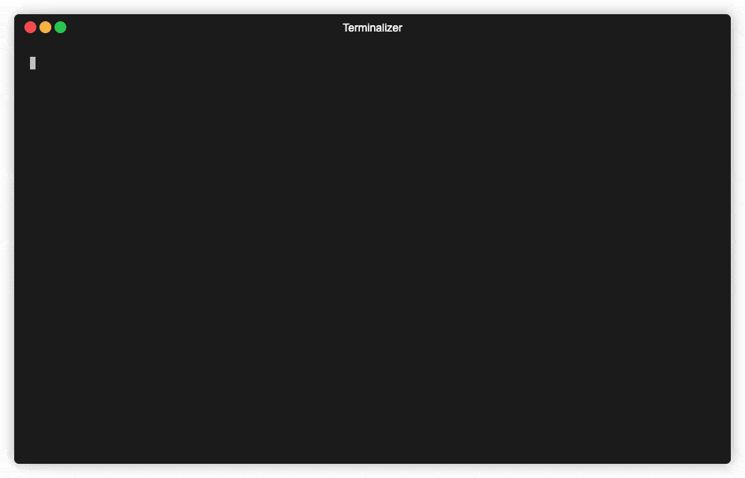

# 千帆 CLI

千帆 SDK 提供了 CLI 工具，方便在命令行中直接使用千帆平台各项功能。

**使用方法**:

```console
$ qianfan-cli [OPTIONS] COMMAND [ARGS]...
```

**基础参数**:

* `--access-key TEXT`
* `--secret-key TEXT`
* `--install-completion`: 为当前 shell 安装自动补全脚本
* `--show-completion`: 展示自动补全脚本
* `--help`: 打印帮助文档

**命令**:

* `chat` 对话
* `completion` 补全
* `txt2img` 文生图

## chat 对话



**用法**:

```console
$ qianfan-cli chat [OPTIONS]
```

**Options 选项**:

* `--model TEXT`: 模型名称  [default: ERNIE-Bot-turbo]
* `--endpoint TEXT`: 模型的 endpoint
* `--multi-line / --no-multi-line`: 多行模式，通过两次回车确认提交消息  [default: no-multi-line]
* `--help`: 展示帮助文档

## completion 补全


**用法**:

```console
$ qianfan-cli completion [OPTIONS] MESSAGES...
```

**Arguments 参数**:

* `MESSAGES...`: 需要补全的 prompt，支持传递多个 prompt 以表示对话历史  [required]

**Options 选项**:

* `--model TEXT`: 模型名称  [default: ERNIE-Bot-turbo]
* `--endpoint TEXT`: 模型的 endpoint
* `--plain / --no-plain`: 普通文本模式，不使用特殊字符  [default: no-plain]
* `--help`: 展示帮助文档

## txt2img 文生图


**用法**:

```console
$ qianfan-cli txt2img [OPTIONS] PROMPT
```

**Arguments 参数**:

* `PROMPT`: 生成图片的 prompt  [required]

**Options 选项**:

* `--negative-prompt TEXT`: 生成图片的负向 prompt
* `--model TEXT`: 使用的模型名称  [default: Stable-Diffusion-XL]
* `--endpoint TEXT`: 使用的模型 endpoint
* `--output PATH`: 输出的文件名称  [default: %Y%m%d_%H%M%S.jpg]
* `--plain / --no-plain`: 普通文本模式，不使用特殊字符  [default: no-plain]
* `--help`: 展示帮助文档
