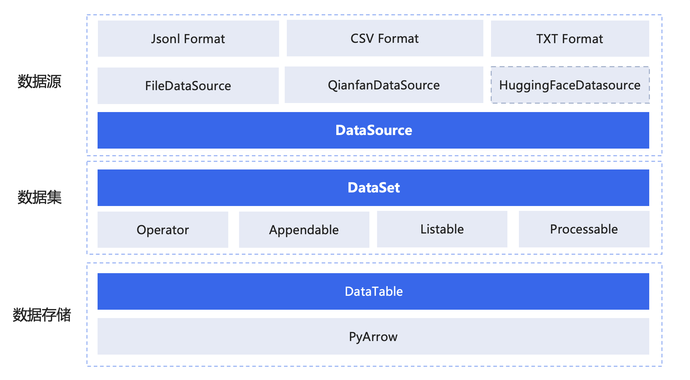

# Dataset 数据集组件

千帆 Python SDK 提供了本地进行数据集管理、处理的能力。

现阶段支持的功能有：
+ 数据集管理
  + 文件系统
    + 从本地文件创建数据集
    + 将数据集导出到本地文件
  + 千帆平台
    + 在千帆平台创建数据集
    + 将千帆数据集导出为本地数据集
    + 将本地数据集通过私人 BOS 存储上传到千帆平台
  + 内存
    + 从 HuggingFace 数据集创建 
    + 从 Python 对象创建数据集
    + 从  `pyarrow.Table`  创建数据集
+ 数据集处理
  + 数据集检视
    + 本地数据集展示
    + 千帆平台远端数据集本地预览
  + 数据集清洗
    + 本地链式处理
    + 千帆平台在线数据处理
  + 数据集校验
    + 使用千帆平台校验规则
    + 自行编写校验规则

## 目录

- [快速开始](#快速开始)
  * [创建数据集](#创建数据集)
  * [处理数据集](#处理数据集)
  * [导出数据集](#导出数据集)
- [数据集管理](#数据集管理)
  * [文件系统](#文件系统)
    + [导入](#导入)
    + [导出](#导出)
    + [文件数据源](#文件数据源)
  * [千帆平台](#千帆平台)
    + [导入](#导入-1)
    + [导出](#导出-1)
    + [千帆数据源](#千帆数据源)
  * [从 HuggingFace 数据集导入](#从-huggingface-数据集导入)
  * [从 Bos 导入](#从-Bos-导入)
  * [Python 对象](#python-对象)
  * [包装与拆分](#包装与拆分)
- [数据集处理](#数据集处理)
  * [数据集检视](#数据集检视)
    + [行](#行)
    + [列](#列)
    + [千帆数据集预览](#千帆数据集预览)
  * [数据集清洗](#数据集清洗)
    + [本地数据集清洗](#本地数据集清洗)
    + [内置数据处理算子](#内置数据处理算子)
    + [千帆平台的在线数据处理](#千帆平台的在线数据处理)
  * [数据集校验](#数据集校验)
  * [自行编写校验规则](#自行编写校验规则)


## 快速开始

如果用户想要快速上手数据集相关能力，可按照下列三步进行操作。

### 创建数据集

创建数据集最简单的方法，就是从本地文件创建、或从千帆平台导出

```python
from qianfan.dataset import Dataset

# 从本地文件导入
ds = Dataset.load(data_file="path/to/dataset_file.jsonl")

# 从千帆导入
ds = Dataset.load(qianfan_dataset_id="your_dataset_id")
```

### 处理数据集

当你已经创建好数据集后，就可以对数据进行处理了。

```python
from typing import Dict, Any

def filter_func(row: Dict[str, Any]) -> bool:
  # 编写你的过滤逻辑
  return "sensitive data for example" not in row["col1"]

def map_func(row: Dict[str, Any]) -> Dict[str, Any]:
  # 编写你的映射逻辑
  return {
    "col1": row["col1"].replace("sensitive data for example", ""),
    "col2": row["col2"]
  }

print(ds.filter(filter_func).map(map_func).list())
```

### 导出数据集

处理完数据集后，你可以将数据集导出到本地文件、或上传到千帆平台。

```python
# 导出到本地文件
new_ds = ds.save(data_file="path/to/local_file.csv")

# 导出到千帆平台
new_ds = ds.save(qianfan_dataset_id="your_dataset_id")

# 或者导出到它导入的地方
new_ds = ds.save()
```

恭喜你，已经学会了如何使用千帆 Python SDK 的数据集相关能力。

接下来将会更加细致的讲解各个模块和功能点之间的作用

## 数据集管理

千帆 Python SDK 现支持用户通过 SDK 对本地或千帆平台的数据集进行管理，以及通过多种方式创建数据集。

### 文件系统

#### 导入
用户可以通过 SDK，读取特定格式的文件，并且转换成内存中的数据集对象以供检视、清洗和转换。

```python
from qianfan.dataset import Dataset

ds = Dataset.load(data_file="path/to/dataset_file.json")
print(ds.list())
```

SDK 在读取数据集时，依赖文件后缀对文件类型做自动解析，目前 SDK 支持的文件后缀名包括：
  + json
  + jsonl
  + csv
  + txt

用户也可以传入 `FormatType` 对象来手动指定数据集的文件类型

```python
from qianfan.dataset import Dataset, FormatType

ds = Dataset.load(
  data_file="path/to/dataset_file_without_suffix",
  file_format=FormatType.Json
)

print(ds.list())
```

除了支持从本地文件导入数据集，SDK 还支持用户从文件夹中批量导入数据集。这种方式需要用户在导入时手动设置 `FormatType` 对象来指定需要读取的文件类型（默认为 txt），并手动维护将会被读取的文件的格式一致性。如果需要校验，可以设置 schema 参数。

文件夹导入会遍历目标文件夹下的所有文件和子文件夹

```python
from qianfan.dataset import Dataset, FormatType

ds = Dataset.load(
  data_file="path/to/folder",
  file_format=FormatType.Json,
)
print(ds.list())
```

#### 导出

和导入类似，用户可以通过 SDK 提供的 `save` 方法将数据集导出到本地文件中。

如果是从文件导入创建的数据集，直接执行 `ds.save()` 会将数据集数据覆盖写入到导入时的文件

用户可以传递 `data_file` 参数来指定导出到的文件路径，同时可以传递 `file_format` 参数来指定导出的格式

```python
from qianfan.dataset import Dataset, FormatType

ds = Dataset.load(
  data_file="path/to/dataset_file_without_suffix",
  file_format=FormatType.Json
)

new_ds = ds.save(
  data_file="another/path/to/local_file",
  file_format=FormatType.Csv
)
```

`save` 方法同样支持用户传递文件夹路径并且设置 `save_as_folder` 参数，以将数据集中的单一条目当做文件，导出到指定文件夹目录下，SDK 会自动为导出的文件进行命名。这种导出方式仅支持 `Text` 格式导出，其它格式仍然按照单个文件导出

```python
from qianfan.dataset import Dataset, FormatType

ds = Dataset.load(
  data_file="path/to/dataset_file_without_suffix",
  file_format=FormatType.Json
)

new_ds = ds.save(
  data_file="path/to/folder",
  file_format=FormatType.Text,
  save_as_folder=True,
)
```

#### 文件数据源

除了在 `load` 中传递文件路径创建数据集，SDK 还支持通过文件数据源 `FileDataSource` 来创建数据集。

创建和使用文件数据源的方式如下所示：

```python
from qianfan.dataset import Dataset
from qianfan.dataset.data_source import FileDataSource

file_source = FileDataSource(path="local_file.json")
ds = Dataset.load(file_source)
```

`FileDataSource` 同样支持用户传递 `file_format` 自己手动指定文件类型

```python, FileDataSource, FormatType
file_source = FileDataSource(
  path="local_file",
  file_format=FormatType.Json
)
```

文件数据源同样可以作为 `save` 的参数，来指定导出的文件路径

```python
from qianfan.dataset import Dataset, FormatType
from qianfan.dataset.data_source import FileDataSource

file_source = FileDataSource(
  path="local_file_folder",
  file_format=FormatType.Text,
  save_as_folder=True,
)

ds = Dataset.load(
  data_file="path/to/dataset_file_without_suffix",
  file_format=FormatType.Json
)

new_ds = ds.save(file_source)
```

当我们在使用文件数据源作为 `save` 的入参时（传递 `data_file` 作为参数同理），用户还可以指定 `batch_size` 参数，来调整数据集批量写入到文件时的批大小，默认为 100

```python
new_ds = ds.save(file_source, batch_size=100)
# 传递路径时 batch_size 依然生效
new_ds = ds.save(data_file="file.json", batch_size=100)
```

### 千帆平台

千帆 Python SDK 对接了千帆平台，让用户可以在本地对平台数据集进行处理

#### 导入

`Dataset`  对象封装的 `load ` 方法支持用户传入已经存在的千帆平台数据集版本 ID 以在本地创建一个数据集

```python
from qianfan.dataset import Dataset

ds_qianfan = Dataset.load(qianfan_dataset_id="your_dataset_id")
print(ds_qianfan.list())
```

此时 SDK 在本地程序中创建了一个指向千帆平台数据集的 `Dataset` 对象，如果用户需要通过 SDK 对千帆平台上的数据集做远端操作，如在线推理 / 评估，或发起在线的数据清洗等，用户可以直接使用该对象进行操作

如果用户想要将数据集下载到本地进行处理，那么用户需要将该数据集对象先保存到本地：

```python
from qianfan.dataset import Dataset

ds_local = Dataset.load(qianfan_dataset_id="your_dataset_id").save(data_file="your_file_path")
print(ds_local.list())
```

#### 导出

用户可以将数据集导出到千帆平台的数据集中，千帆 Python SDK 支持两种导出方式：

+ 一种导出方式是导出到一个全新的千帆平台数据集当中：填写 `save` 函数 `qianfan_dataset_create_args` 参数。该参数是一个字典，里面包含了用于创建千帆数据集所需的所有参数。

  主要的参数包括：
  + name: 千帆平台数据集名称
  + template_type: 千帆平台数据集模板类型
  + storage_type: 千帆平台数据集存储类型

```python
ds_qianfan.save(
  qianfan_dataset_create_args={
    "name": "example_name",
    "template_type": DataTemplateType.NonSortedConversation,
    "storage_type": DataStorageType.PrivateBos,
    "storage_id": "your_bucket_name",
    "storage_path": "/your_desired_dataset_path/",
  },
)
```

> 以 `sup` 开头的参数为辅助上传数据集时用到的 Bos 信息。当且仅当目标的千帆数据集使用公共存储（公共 BOS，对应 `DataStorageType.PublicBos`）数据时需要填写，详情见下

+ 另一种导出方式是增量导出到已经存在的数据集当中：填写 `save` 函数的 `qianfan_dataset_id` 参数（和 `load` 方法一致）。如果是导出到原本导入的数据集，则可以忽略 `qianfan_dataset_id` 参数。

```python
ds_qianfan.save(qianfan_dataset_id="your_dataset_id")
# 如果是导出到原本导入的数据集，可以忽略该参数
ds_qianfan.save()
```

​		这种导出方式目前暂不支持导出到新数据集版本进行覆盖导出。若用户有覆盖导出的需求，请使用方式一。

#### 千帆数据源

和从文件系统导入一致，千帆 Python SDK 也同样内置了千帆数据源，用作数据集 `load` 或者 `save` 操作的入参。目前 SDK 支持用户在本地全新创建一个千帆数据源，代表在千帆平台上创建一个新的数据集组，默认包含一个数据集；或者在本地创建一个千帆数据源以代表平台上已经存在的数据集。

```python
from qianfan.dataset import DataTemplateType
from qianfan.dataset.data_source import QianfanDataSource

# 创建一个映射到已存在的数据集的千帆数据源
data_source = QianfanDataSource.get_existed_dataset("your_dataset_id")

# 创建一个全新的数据源，同时在平台创建一个新的数据集组
data_source = QianfanDataSource.create_bare_dataset(
  "data_group_name",
  DataTemplateType.NonSortedConversation
)
```

> 注意：如果将数据集 `save` 到千帆平台，请确认目的千帆平台数据集是使用个人 BOS 存储的数据集，SDK 不支持从本地保存数据到平台的公共 BOS 中。
> 如有相关需求，用户可以向 `save` 函数中传递 `sup_storage_id` `sup_storage_path` 和 `sup_storage_region` 参数，指定用作中间存储的私有 BOS 信息。使用的 BOS 必须是位于北京区域的 BOS 。

### 从 HuggingFace 数据集导入

用户如果想将已有的 HuggingFace 数据集转换到 SDK 的 `Dataset` 对象，只需要在 `load` 方法中的 `huggingface_dataset` 参数内传入 HuggingFace 数据集对象即可

```python
from datasets import load_dataset

from qianfan.dataset import Dataset

huggingface_ds = load_dataset(
    "cais/mmlu", "abstract_algebra", split="auxiliary_train"
)

qianfan_ds = Dataset.load(huggingface_dataset=huggingface_ds)
print(qianfan_ds.list())
```

### 从 Bos 导入

千帆 SDK 还支持用户直接与百度 Bos 交互，实现数据集在百度 Bos 上的上传和下载

```python
from qianfan.dataset import Dataset
from qianfan.dataset.data_source import BosDataSource

bds = BosDataSource(region="your_bos_region", bucket="your_bucket_name", bos_file_path="file/path/to/your/file.jsonl")

bos_ds = Dataset.load(bds)
print(bos_ds.list())
```

### Python 对象

`Dataset` 类还提供了 `create_from_pyobj` 方法与 `create_from_pyarrow_table` 方法来创建一个新的本地数据集对象，分别使用 Python 的集合对象或者 `pyarrow.Table` 对象来创建数据集

```python
from pyarrow import Table
from qianfan.dataset import Dataset

ds_pyobj = Dataset.create_from_pyobj([{"column_name1": "column_data1"}])
ds_pyarrow_table = Dataset.create_from_pyarrow_table(Table.from_pandas(...))
```

### 包装与拆分

除此之外，当用户以 jsonl \ txt 格式导入类数组形式文件，或者导入的是千帆平台的数据集时，SDK 支持传入 `organize_data_as_group` 参数，来指定将数据集组织成 SDK 内部的二维表格形式。这种格式包含了分组信息。并且可以通过 `pack()` 与 `unpack()` 函数进行格式之间的互相转换。

```python
ds = Dataset.load(qianfan_dataset_id="your_dataset_id", organize_data_as_group=True)
```

设置 `organize_data_as_group=True` 或使用 `unpack()` 函数得到的千帆平台的数据集格式如下所示

| prompt | response | _group |
|--------|----------|--------|
| 12     | [["12"]] | 0      |
| 12     | [["12"]] | 0      |
| 34     | [["34"]] | 1      |

其中 `_group` 列表示数据集的分组信息。在这种格式下，用户可以更加方便的进行对行与列的处理。

不设置 `organize_data_as_group` 或使用 `pack()` 函数得到的展开后的实际格式如下所示

| _pack                                                                            |
|----------------------------------------------------------------------------------|
| [{"prompt": "12", "response": [["12"]]}, {"prompt": "12", "response": [["12"]]}] |
| [{"prompt": "34", "response": [["34"]]}]                                         |


但 SDK 在处理时会对上述格式进行封装与处理，最终在行的角度上屏蔽 `_pack` 列，展现给用户的数据形式是一个二维数组，而非二维表。如下所示：

| [{"prompt": "12", "response": [["12"]]}, {"prompt": "12", "response": [["12"]]}] |
|----------------------------------------------------------------------------------|
| [{"prompt": "34", "response": [["34"]]}]                                         |

## 数据集处理

在创建了 `Dataset` 对象后，用户可以使用千帆 Python SDK 的功能，对数据集进行简单的本地或在线处理。

### 数据集检视

#### 行

用户可以使用 `Dataset` 的 `list` 函数对数据集的行进行检视。`list` 的返回值是包含了行数据的列表，每条行数据是包含了列名与列数据的字典。`list` 函数可以接受的入参类型包括：

+ 整数：取数据集指定下标的行
+ `List[int]` 或 `Tuple[int]` ：取所有元素的下标的行
+ `slice` ：取该闭区间内的行

```python
from qianfan.dataset import Dataset

ds = Dataset.create_from_pyobj([
  {"column_name1": "column_data1"},
  {"column_name1": "column_data2"},
  {"column_name1": "column_data3"},
])

# 取下标行
print(ds.list(0))

# 取指定下标的行
print(ds.list([0, 2]))

# 取闭区间内的行
print(ds.list(slice(0, 1)))
```

除了调用 `list` 函数，用户还可以使用中括号来替代 `list` ，二者等价。因此上面的例子可以改写为：

```python
from qianfan.dataset import Dataset

ds = Dataset.create_from_pyobj([
  {"column_name1": "column_data1"},
  {"column_name1": "column_data2"},
  {"column_name1": "column_data3"},
])

# 取下标行
print(ds[0])

# 取指定下标的行
print(ds[[0, 2]])

# 取闭区间内的行
print(ds[slice(0, 1)])
```

#### 列

`Dataset` 同时也支持用户使用 `col_list` 对列进行检视。`col_list` 的返回值是一个字典，其中的键为列名，值为列元素。`col_list` 函数可以接受的入参类型包括：

+ 整数：取数据集指定下标的列
+ 字符串：取指定列名的列
+ `List[int]` ，`List[str]` ，`Tuple[int]` ，`Tuple[str]` ：取所有元素下标的列，或取所有指定列名的列

```python
from qianfan.dataset import Dataset

ds = Dataset.create_from_pyobj([{
  "column_name1": "column_data1",
  "column_name2": "column_data2",
  "column_name3": "column_data3",
}])

# 取下标列
print(ds.col_list(0))

# 取指定下标的列
print(ds.col_list([0, 2]))

# 取指定列名的列
print(ds.col_list(["column_name1", "column_name3"]))
```

如果用户使用的是列名字符串来查找列，那么上面的例子同样也可以使用 `[]` 来改写：

```python
from qianfan.dataset import Dataset

ds = Dataset.create_from_pyobj([{
  "column_name1": "column_data1",
  "column_name2": "column_data2",
  "column_name3": "column_data3",
}])

# 取指定列名的列
print(ds["column_name1"])

# 取指定列名列表的列
print(ds[["column_name1", "column_name3"]])
```

#### 千帆数据集预览

如果用来创建 `Dataset` 对象的源数据源是 `QianfanDataSource` 千帆数据源，则用户可以通过 `list` 函数或 `[]` 对云上数据集进行本地预览，而无需下载数据。此时返回的是包含云上数据实体的字典列表。可接受的入参类型包括：

+ 整数：取指定下标的实体
+ `slice` ：取左闭右开区间内的实体

```python
from qianfan.dataset import Dataset

ds_qianfan = Dataset.load(qianfan_dataset_id="your_dataset_id")

# 单独检视某一实体
print(ds_qianfan[0])

# 检视某一区间内的实体
print(ds_qianfan[slice(0, 2)])
```

### 数据集清洗

千帆 Python SDK 提供了简单的数据清洗能力，分为本地数据清洗与千帆平台的在线数据处理

#### 本地数据集清洗

在创建 `Dataset` 后，用户可以使用 `map` ，`filter` ，`append`，`insert` ，`delete` 等函数对行进行修改；也可以使用 `col_map` ，`col_filter` ，`col_append` ，`col_delete` 等函数对列进行修改。以上函数都支持链式调用。

```python
from qianfan.dataset import Dataset

ds = Dataset.create_from_pyobj([{
  "column_name1": "column_data1",
  "column_name2": "column_data2",
  "column_name3": "column_data3",
}])

ds = ds \
  .filter(lambda obj: obj["column_name1"] == "column_data1") \
  .filter(filter_func) \
  .filter(...) \
  .map(...) \
  .append(({
    "column_name1": "column_data1",
    "column_name2": "column_data2",
    "column_name3": "column_data3",
  }))
```

#### 特殊情况

如果用户导入的数据集是类似列表格式的数据，基本的处理单位按行计，即传递给 `map()` 和 `filter()` 回调的内容是一行的元素，而不是包含 "列名: 列值" 的字典。

同样的， `list()` 的返回值也是包含了行列表的列表，而不是包含行字典的列表。

`insert()` 与 `append()` 接受传递二维列表 `List[List[Any]]` 做批量插入，或传入 `List[Any]` 以及 `Any` 插入单行。

#### 内置数据处理算子

为了提升开发者的使用体验，千帆 SDK 内置了一系列数据处理算子，用户可以直接使用这些算子进行数据处理操作。具体的使用方式请看[文档](./local_data_clean.md)

#### 千帆平台的在线数据处理

如果用来创建 `Dataset` 对象的源数据源是 `QianfanDataSource` 千帆数据源，则用户可以通过 `Dataset` 对象的 `online_data_process` 接口，在千帆平台上发起一个数据清洗任务。`online_data_process` 需要传入清洗时使用的 `operator` 对象列表。具体定义可以在  `qianfan/dataset/data_operator.py` 中找到。一共存在四个大类的 `operator` ，分别对应千帆平台数据清洗时的四个阶段。每个大类下都有一个或多个具体的 `operator` 类可供使用。部分对象提供可选或必选参数进行填写。

```python
from qianfan.dataset import Dataset
from qianfan.dataset.qianfan_data_operators import (
  RemoveInvisibleCharacter,
  FilterCheckNumberWords,
  DeduplicationSimhash,
  ReplaceEmails,
)

ds_qianfan = Dataset.load(qianfan_dataset_id="your_dataset_id")

ds_qianfan.online_data_process([
  RemoveInvisibleCharacter(),
  FilterCheckNumberWords(number_words_max_cutoff=1024),
  DeduplicationSimhash(distance=5),
  ReplaceEmails()
])
```

### 数据集校验

为了方便用户对数据集的格式以及内容进行校验，千帆 Python SDK 内提供了 `Schema` 类用于数据集格式与内容的校验，同时提供了针对千帆平台部分数据集类型的 `Schema` 实现。用户可以在 `load` 或者 `save` 时指定 `schema` 参数，传入一个 `Schema` 类的对象，以在不同的阶段对数据集进行校验；也可以单独创建一个 `Schema` 对象，调用 `validate` 方法对数据集进行校验

```python
from qianfan.dataset import Dataset
from qianfan.dataset.schema import QianfanNonSortedConversation

schema = QianfanNonSortedConversation()

# 在 load 时使用
ds_qianfan = Dataset.load(qianfan_dataset_id="your_dataset_id", schema=schema)

# 在 save 时使用
# 如果在 load 时就已经传入了 schema ，
# 则默认使用 load 的 schema 进行校验
# 额外传入则会覆盖原有的 schema，
# 使用新的 schema 进行校验
ds_qianfan.save(schema=schema)

# 单独使用
schema.validate(ds_qianfan)
```

### 自行编写校验规则

用户可以编写派生自 `Schema` 的子类，实现自己的校验逻辑

```python
from qianfan.dataset import Table
from qianfan.dataset.schema import Schema

class YourSchema(Schema):
  def validate(self, table: Table) -> bool:
    ...
```

