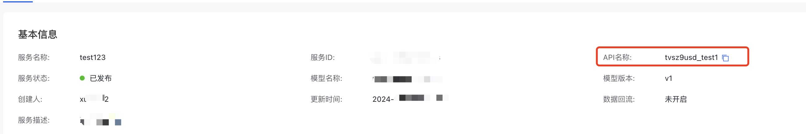

# 大模型推理

+ [Chat 对话](#chat-对话)
  + [统计信息](#统计信息)
+ [Completion 续写](#completion-续写)
+ [Embedding 向量化](#embedding-向量化)
+ [Plugin 插件调用](#plugin-插件)
+ [文生图](#文生图)
+ [批量推理](#批量推理)
+ [类OpenAI入口](#类OpenAI入口)

### OpenAI迁移
如果您已经使用了OpenAI SDK 或集成了 OpenAI API，那么您可以直接使用千帆Python SDK提供的OpenAI适配器，以快速接入千帆大模型平台：

[QuickLink](./cli.md#千帆-openai-适配器)

#### **Chat 对话**

用户只需要提供预期使用的模型名称和对话内容，即可调用千帆大模型平台支持的，包括 ERNIE系列 在内的所有预置模型，如下所示：

```python
import qianfan

# 指定特定模型
# 模型名称可以通过 qianfan.ChatCompletion.models() 获取
# 也可以在命令行运行 qianfan chat --list-model 查看
# 如果不设置 model，则使用默认模型
chat_comp = qianfan.ChatCompletion(model="ERNIE-Speed-8K")

# 对于自行发布的模型，或者是不在预置模型列表中的模型，用户可以通过指定 endpoint 调用
# endpoint 指模型 API 地址的最后一个 / 后的部分，例如 ernie_speed
chat_comp = qianfan.ChatCompletion(endpoint="your_custom_endpoint")

# 调用模型
resp = chat_comp.do(messages=[{
    "role": "user",
    "content": "你好"
}])

print(resp['result'])
# 输入：你好
# 输出：你好！有什么我可以帮助你的吗？

# 也可以调用时设置 model 或者 endpoint，这将覆盖之前设置的 model 和 endpoint
resp = chat_comp.do(
    model="ERNIE-3.5-8K",
    messages=[{"role": "user", "content": "你好"}],
    # 还可以设置其他参数，例如 temperature、top_p 等，此处字段名与 API 参数一致
    # 具体可以参考每个模型对应的 API 文档
    temperature=0.5,
    top_p=0.9,
)

# 也可以利用内置 Messages 简化多轮对话
# 下面是一个简单的用户对话案例，实现了对话内容的记录
msgs = qianfan.Messages()
while True:
    msgs.append(input())         # 增加用户输入
    resp = chat_comp.do(messages=msgs)
    print(resp)	                 # 打印输出
    msgs.append(resp)            # 增加模型输出
```

目前，千帆大模型平台提供了一系列可供用户通过 SDK 直接使用的模型，部分支持的模型如下所示：

- [ERNIE-4.0-8K](https://cloud.baidu.com/doc/WENXINWORKSHOP/s/clntwmv7t)
- [ERNIE-3.5-8K](https://cloud.baidu.com/doc/WENXINWORKSHOP/s/jlil56u11)
- [ERNIE-Speed-8K](https://cloud.baidu.com/doc/WENXINWORKSHOP/s/klqx7b1xf)
- [ERNIE-Lite-8K-0922](https://cloud.baidu.com/doc/WENXINWORKSHOP/s/4lilb2lpf) （默认）
- [ERNIE Speed-AppBuilder](https://cloud.baidu.com/doc/WENXINWORKSHOP/s/Alp0kdm0n)
- [Meta-Llama-3-8B](https://cloud.baidu.com/doc/WENXINWORKSHOP/s/ilv62om62)
- [Meta-Llama-3-70B](https://cloud.baidu.com/doc/WENXINWORKSHOP/s/3lv6364k8)
- [BLOOMZ-7B](https://cloud.baidu.com/doc/WENXINWORKSHOP/s/Jljcadglj)
- [Llama-2-7b-chat](https://cloud.baidu.com/doc/WENXINWORKSHOP/s/Rlki1zlai)
- [Llama-2-13b-chat](https://cloud.baidu.com/doc/WENXINWORKSHOP/s/2lki2us1e)
- [Llama-2-70b-chat](https://cloud.baidu.com/doc/WENXINWORKSHOP/s/8lkjfhiyt)
- [Qianfan-BLOOMZ-7B-compressed](https://cloud.baidu.com/doc/WENXINWORKSHOP/s/nllyzpcmp)
- [Qianfan-Chinese-Llama-2-7B](https://cloud.baidu.com/doc/WENXINWORKSHOP/s/Sllyztytp)
- [Qianfan-Chinese-Llama-2-13B](https://cloud.baidu.com/doc/WENXINWORKSHOP/s/8lo479b4b)
- [ChatGLM2-6B-32K](https://cloud.baidu.com/doc/WENXINWORKSHOP/s/Bllz001ff)
- [AquilaChat-7B](https://cloud.baidu.com/doc/WENXINWORKSHOP/s/ollz02e7i)
- [XuanYuan-70B-Chat-4bit](https://cloud.baidu.com/doc/WENXINWORKSHOP/s/Ylp88e5jc)
- 更多模型请参考 [千帆大模型平台Chat](https://cloud.baidu.com/doc/WENXINWORKSHOP/s/Zlt2agedu#%E5%AF%B9%E8%AF%9Dchat)


> [!IMPORTANT]
> 
> 完整的预置模型列表可以通过 `qianfan.ChatCompletion().models()` 获得，也可以在命令行运行 `qianfan chat --list-model` 查看。
> 
> 随着平台更新，预置模型列表也可能有所变化，在使用 Access Key 进行鉴权时 SDK 会自动获取最新的模型。如果通过应用 AK 鉴权，则只能使用 SDK 预置的模型，可能会过时，请注意更新 SDK。

对于那些不在清单中的其他模型，用户可通过传入 `endpoint` 来使用它们。

> endpoint 指发布模型时 API 地址最后需要填入的地址，也同样适用于预置模型。
>
> 例如 ERNIE Speed 的 API 地址为 `https://aip.baidubce.com/rpc/2.0/ai_custom/v1/wenxinworkshop/chat/ernie_speed`，则 endpoint 为 URL 最后一部分 `ernie_speed`。

除了通过  `do`  方法同步调用千帆 SDK 以外， SDK 还支持使用 `ado` 来异步调用千帆 SDK。在同步和异步的基础上，用户还可以传入 `stream=True` 来实现大模型输出结果的流式返回。示例代码如下所示：

```python
# 流式调用
resp = chat_comp.do(messages=[{
    "role": "user",
    "content": "你好"
}], stream=True)

for r in resp:
    print(r['result'])

# 异步调用
resp = await chat_comp.ado(messages=[{
    "role": "user",
    "content": "你好"
}])
print(resp['body']['result'])

# 异步流式调用
resp = await chat_comp.ado(messages=[{
    "role": "user",
    "content": "你好"
}], stream=True)

async for r in resp:
    print(r['result'])
```

本文所有大模型返回的结果（对于流式请求，则每个返回值）是一个 `QfResponse` 对象，具有如下字段

- `body`：API 返回的结果。可以通过 `[]` 简化调用直接获取 body 字段，例如 `resp.body['result']` 与 `resp['result']` 等价。
- `code`：返回的 HTTP 状态码。
- `headers`：返回的 HTTP 头。
- `statistic`：请求相关的统计信息，包含如下字段, 仅 `show_total_latency=True` 时有效
  - `request_latency`：请求延迟，单位为秒
  - `first_token_latency`：第一个 token 的延迟，单位为秒
  - `total_latency`：总调用延迟，包含了请求、序列化、限流等耗时，单位为秒
  - `start_timestamp`： 请求开始时间戳，单位为毫秒
  - `avg_output_tokens_per_second`： 平均每秒输出 token 数
- `request`：请求的原始信息，包含如下字段
  - `method`：请求方法
  - `url`：请求的 URL
  - `query`：请求的 query 字典
  - `headers`：请求的 header 字典
  - `json_body`：请求体
  - `retry_config`：请求使用的重试信息


##### 统计信息
> [!IMPORTANT] 
>
> 为了不影响请求的性能并获取准确的延迟信息，我们默认会关闭statistic统计功能，如果需要开启统计功能，请在创建对象时设置`show_total_latency`：
> ```python
> qianfan.ChatCompletion().do(messages=[{"role":"user", "content":"hi"}], show_total_latency=True)
> ```
> 在开启 show_total_latency 时，SDK 会在每次请求时启动一个单独的后台线程进行输出的预读取。在极端场景下可能会因无法创建线程而异常抛出。
>
> 对于这种情况，用户在使用时，可以在创建请求对象时设置 `sync_reading_thread_count=最大线程数` 来避免此问题：
> ```python
> qianfan.ChatCompletion(sync_reading_thread_count=500).do(messages=[{"role":"user", "content":"hi"}], show_total_latency=True)
> ```

以下是一个获取流式请求包间延迟的例子：
```python
from qianfan import ChatCompletion

chat = ChatCompletion()

resp = chat.do(messages=[{"role": "user", "content": "你好"}], stream=True, show_total_latency=True)
for r in resp:
    print(r['statistic']['request_latency'])
```


#### V2 版本

千帆平台推出了 V2 版本的推理 API，SDK 也支持对 V2 版本的 API 进行调用：

##### V2 鉴权

API v2 采用Bearer Token的鉴权方式：可以通过access_key 和 secret_key 获取。因此可以选择以下两种方式设置鉴权信息：
```python
import os
# 安全认证
os.environ['QIANFAN_ACCESS_KEY'] = 'your_access_key'
os.environ['QIANFAN_SECRET_KEY'] = 'your_secret_key'
# 或 bearer token
os.environ['QIANFAN_BEARER_TOKEN'] = 'your_bearer_token'
```

我们可以运行以下接口获取BEARER_TOKEN（可用于需要临时鉴权，或进行应用分发的场景）：

```python
import os
os.environ['QIANFAN_ACCESS_KEY'] = 'your_access_key'
os.environ['QIANFAN_SECRET_KEY'] = 'your_secret_key'

resp = IAM.create_bearer_token(100)
print(resp.body)
token = resp.body["token"]
```

##### V2 示例:

只需要创建对象时传入 `version="2"` 即可，其余使用方法与上述一致，差异点主要在于字段名称，具体字段名请参考 API 文档

```python
# 在创建时传入 version 以使用 V2 版本
# model 字段为可选，默认为 ernie-speed-8k，也可以指定其他模型，后续调用均会使用该模型
chat = qianfan.ChatCompletion(version="2", app_id='app-xxx', model="ernie-speed-8k")

# 调用方式与 V1 版本一致，具体字段名参考 API 文档
resp = chat.do(
    messages=[{"role": "user", "content": "你好"}],
    model="ernie-3.5-8k",  # 可选，此处指定模型，将在该次调用覆盖之前设置的 model
    preemptable=True,
    top_p=0.5,
)
print(resp["choices"][0]["message"]["content"])

# 也支持流式与异步调用方式
resp = c.do(
    messages=[{"role": "user", "content": "你好"}],
    stream=True,
)

for r in resp:
    print(r["choices"][0]["delta"]["content"])
```

#### **Completion 续写**

对于不需要对话，仅需要根据 prompt 进行补全的场景来说，用户可以使用 `qianfan.Completion` 来完成这一任务。

```python
import qianfan

# 指定特定模型
# 模型名称可以通过 qianfan.Completion.models() 获取
# 也可以在命令行运行 qianfan completion --list-model 查看
# 如果不设置 model，则使用默认模型 ERNIE-Lite-8K
comp = qianfan.Completion(model="ERNIE-Speed-8K")

# 对于自行发布的模型，或者是不在预置模型列表中的模型，用户可以通过指定 endpoint 调用
# endpoint 指模型 API 地址的最后一个 / 后的部分，例如 ernie_speed
comp = qianfan.Completion(endpoint="your_custom_endpoint")

resp = comp.do(prompt="你好")
print(resp['result'])
# 输出：你好！有什么我可以帮助你的吗？

# 也可以调用时设置 model 或者 endpoint，这将覆盖之前设置的 model 和 endpoint
resp = comp.do(
    model="ERNIE-3.5-8K",
    prompt="你好",
    # 还可以设置其他参数，例如 temperature、top_p 等，此处字段名与 API 参数一致
    # 具体可以参考每个模型对应的 API 文档
    temperature=0.5
)

# 续写功能同样支持流式调用
resp = comp.do(prompt="你好", stream=True)
for r in resp:
    print(r['result'])

# 异步调用
resp = await comp.ado(prompt="你好")
print(resp['body']['result'])

# 异步流式调用
resp = await comp.ado(prompt="你好", stream=True)
async for r in resp:
    print(r['result'])
```

目前，平台预置的续写模型有：

- [SQLCoder-7B](https://cloud.baidu.com/doc/WENXINWORKSHOP/s/Hlo472sa2)
- [CodeLlama-7b-Instruct](https://cloud.baidu.com/doc/WENXINWORKSHOP/s/ylo47d03k)
- 更多模型请参考 [千帆大模型平台Completion](https://cloud.baidu.com/doc/WENXINWORKSHOP/s/Zlt2agedu#%E7%BB%AD%E5%86%99completions)

> [!IMPORTANT]
> 
> 完整的预置模型列表可以通过 `qianfan.Completion().models()` 获得，也可以在命令行运行 `qianfan completion --list-model` 查看。
> 
> 随着平台更新，预置模型列表也可能有所变化，在使用 Access Key 进行鉴权时 SDK 会自动获取最新的模型。如果通过应用 AK 鉴权，则只能使用 SDK 预置的模型，可能会过时，请注意更新 SDK。

Completion 除了可以调用续写类的模型，也支持调用对话类的模型。

对于那些不在清单中的其他模型，用户可通过传入 `endpoint` 来使用它们。

> endpoint 指发布模型时 API 地址最后需要填入的地址，也同样适用于预置模型。
>
> 例如 ERNIE Speed 的 API 地址为 `https://aip.baidubce.com/rpc/2.0/ai_custom/v1/wenxinworkshop/chat/ernie_speed`，则 endpoint 为 URL 最后一部分 `ernie_speed`。

#### **Embedding 向量化**

千帆 SDK 同样支持调用千帆大模型平台中的模型，将输入文本转化为用浮点数表示的向量形式。转化得到的语义向量可应用于文本检索、信息推荐、知识挖掘等场景。

```python
import qianfan

# 指定特定模型
# 模型名称可以通过 qianfan.Embedding.models() 获取
# 也可以在命令行运行 qianfan embedding --list-model 查看
# 如果不设置 model，则使用默认模型 Embedding-V1
emb = qianfan.Embedding(model="embedding-v1")

# 对于自行发布的模型，或者是不在预置模型列表中的模型，用户可以通过指定 endpoint 调用
# endpoint 指模型 API 地址的最后一个 / 后的部分，例如 embedding-v1
emb = qianfan.Embedding(endpoint="your_custom_endpoint")

resp = emb.do(texts=["世界上最高的山"])
print(resp['data'][0]['embedding'])
# 输出：0.062249645590782166, 0.05107472464442253, 0.033479999750852585, ...]

# 异步调用
resp = await emb.ado(texts=[
    "世界上最高的山"
])
print(resp['data'][0]['embedding'])

# 也可以调用时设置 model 或者 endpoint，这将覆盖之前设置的 model 和 endpoint
resp = emb.do(
    endpoint="your_custom_endpoint", 
    texts=[
        "世界上最高的山"
    ],
    # 还可以设置其他参数，此处字段名与 API 参数一致
    # 具体可以参考每个模型对应的 API 文档
    user_id="xxx",
)
```

如下是目前支持的部分模型：

- [Embedding-V1](https://cloud.baidu.com/doc/WENXINWORKSHOP/s/alj562vvu) （默认）
- [bge-large-en](https://cloud.baidu.com/doc/WENXINWORKSHOP/s/mllz05nzk)
- [bge-large-zh](https://cloud.baidu.com/doc/WENXINWORKSHOP/s/dllz04sro)
- [tao-8k](https://cloud.baidu.com/doc/WENXINWORKSHOP/s/7lq0buxys)
- 更多模型请参考 [千帆大模型平台Embedding](https://cloud.baidu.com/doc/WENXINWORKSHOP/s/Zlt2agedu#%E5%90%91%E9%87%8Fembeddings)

> [!IMPORTANT]
> 
> 完整的预置模型列表可以通过 `qianfan.Embedding().models()` 获得，也可以在命令行运行 `qianfan embedding --list-model` 查看。
> 
> 随着平台更新，预置模型列表也可能有所变化，在使用 Access Key 进行鉴权时 SDK 会自动获取最新的模型。如果通过应用 AK 鉴权，则只能使用 SDK 预置的模型，可能会过时，请注意更新 SDK。

对于那些不在清单中的其他模型，用户可通过传入 `endpoint` 来使用它们。

> endpoint 指发布模型时 API 地址最后需要填入的地址，也同样适用于预置模型。
>
> 例如 Embedding-V1 的 API 地址为 `https://aip.baidubce.com/rpc/2.0/ai_custom/v1/wenxinworkshop/embeddings/embedding-v1`，则 endpoint 为 URL 最后一部分 `embedding-v1`。

#### **Plugin 插件**

当前插件存在两个版本，分别对应model="EBPlugin"和model="EBPluginV2"，默认不传使用前者
```python
# v1
TEST_MESSAGE = [
    {
        "role": "user",
        "content": (
            "请按照下面要求给我生成雷达图：学校教育质量: 维度：师资力量、设施、"
            "课程内容、学生满意度。对象：A,B,C三所学校。学校A的师资力量得分为10分，"
            "设施得分为8分，课程内容的得分为7分，学生满意度的得分为9分。\n*"
            " 学校B的师资力量得分为8分，设施得分为9分，课程内容的得分为8分，"
            "学生满意度的得分为7分。\n* 学校C的师资力量得分为7分，设施得分为7分，"
            "课程内容的得分为9分，学生满意度的得分为8分。"
        ),
    }
]

plugin = qianfan.Plugin()
resp = plugin.do(
    TEST_MESSAGE,
    plugins=["eChart"],
    stream=True
)

# v2
plugin = qianfan.Plugin(model="EBPluginV2")
resp = plugin.do(
    TEST_MESSAGE,
    plugins=["eChart"],
    stream=True
)
```

#### **文生图**

千帆平台提供了热门的文生图功能，千帆SDK支持用户调用SDK来获取文生图结果，以快速集成多模态能力到大模型应用中。

以下是一个使用示例

```python
import qianfan

# 指定特定模型
# 模型名称可以通过 qianfan.Text2Image.models() 获取
# 也可以在命令行运行 qianfan txt2img --list-model 查看
# 如果不设置 model，则使用默认模型 Stable-Diffusion-XL
qfg = qianfan.Text2Image(model="Stable-Diffusion-XL")

# 对于自行发布的模型，或者是不在预置模型列表中的模型，用户可以通过指定 endpoint 调用
# endpoint 指模型 API 地址的最后一个 / 后的部分，例如 sd_xl
qfg = qianfan.Text2Image(endpoint="your_custom_endpoint")

# 调用模型
resp = qfg.do(
    prompt="Rag doll cat",
    with_decode="base64",
    # 还可以设置其他参数，此处字段名与 API 参数一致
    # 具体可以参考每个模型对应的 API 文档
    n=3,
)
img_data = resp["body"]["data"][0]["image"]

img = Image.open(io.BytesIO(img_data))
```

如下是目前支持的部分模型：

- [Stable-Diffusion-XL](https://cloud.baidu.com/doc/WENXINWORKSHOP/s/Klkqubb9w) （默认）


> [!IMPORTANT]
> 
> 完整的预置模型列表可以通过 `qianfan.Text2Image().models()` 获得，也可以在命令行运行 `qianfan txt2img --list-model` 查看。
> 
> 随着平台更新，预置模型列表也可能有所变化，在使用 Access Key 进行鉴权时 SDK 会自动获取最新的模型。如果通过应用 AK 鉴权，则只能使用 SDK 预置的模型，可能会过时，请注意更新 SDK。

对于那些不在清单中的其他模型，用户可通过传入 `endpoint` 来使用它们。

> endpoint 指发布模型时 API 地址最后需要填入的地址，也同样适用于预置模型。
>
> 例如 Stable-Diffusion-XL 的 API 地址为 `https://aip.baidubce.com/rpc/2.0/ai_custom/v1/wenxinworkshop/text2image/sd_xl`，则 endpoint 为 URL 最后一部分 `sd_xl`。

#### **图生文**
千帆平台也提供了图+文生文功能，千帆SDK支持用户调用SDK来获取结果，以快速集成多模态能力到大模型应用中。

以下是一个使用示例
```python
i2t = qianfan.Image2Text(endpoint="....")
resp = i2t.do(prompt="Rag doll cat", "9j/4AAQSkZJRgABAQAAAQABAAD/xxxxx")
print(resp["result"])
```

#### **重排序**
为了提升RAG等检索业务场景的效果，千帆平台也提供了重排序功能，用户可以通过千帆SDK快速调用。

以下是一个使用示例
```python
r = qianfan.Reranker()
res = r.do("北京的天气", ["北京今天12.5度，北风，阴天", "北京美食很多"])
print(res["results"])
```

#### 函数调用(Function calling)
为了提升函数调用的能力，千帆平台专门针对任务规划等函数调用场景推出了`ERNIE-Functions-8K`，可以配套`qianfan.Function`以实现多个函数的函数调用。使用上和ChatCompletion的函数调用类似。

以下是一个使用示例，cookbook可参考：[函数调用](../cookbook/function_call.ipynb)
```python
def get_file_num(language: str) -> str:
    """获取数据库中指定语言的代码文件数量"""
    return 5

func_list = [{
    "name": "get_file_num",  # 函数名称
    "description": "获取内部数据库中以某一编程语言编写的文件数量",  # 函数描述
    "parameters":{
        "type":"object",
        "properties":{  # 参数schema，如果参数为空，设为空字典即可
            "language":{  # 参数名称
                "type":"string",  # 参数类型
                "description": "代码所运用的编程语言，例如：python、c/c++、go、java"  # 参数描述
            }
        },
        "required":["language"]  # 必填参数（无默认值）
    }
}]

f = Function()
query = "请帮我查询一下数据库中用go以及java撰写的代码文件数量"
msgs = qianfan.QfMessages()
msgs.append(query,role='user')
resp = f.do(
    messages=msgs,
    functions=func_list
)

while True:
    func_call_result = resp["function_call"]
    func_name = func_call_result["name"]
    language = json.loads(func_call_result["arguments"]).get("language")
    func_resp = get_file_num(language)
    
    func_content = json.dumps({
        "return":func_resp
    })
    msgs.append(resp, role="assistant")
    msgs.append(func_content, role="function")
    resp = f.do(
        messages=msgs,
        functions=func_list
    )
    
    print(resp['body']['result'])
    if resp.get("function_call") is None:
        break
```

#### **批量推理**

上述模型均提供了 `batch_do` 和异步的 `abatch_do` 方法，方便用户批量进行推理，并通过 `worker_num` 来控制并发量。

`worker_num` 代表同一时刻下，可同时存在的最大链接数。若不手动设置，这个最大链接数会被设置为批量推理的任务数，至多 1000 个。手动设置的 `worker_num` 不受这一限制。

```python
prompt_list = ["你好", "很高兴认识你"]
# 所有模型传入的均为一个 List，但内部元素类型与模型类型相关
# 内部元素类型与 `do` 方法传入的参数类型一致
# 例如 ChatCompletion 则应该传入 List[Union[Dict, QfMessages]]
# 额外参数例如 `model` 等，与 `do` 方法可传入的参数和使用方法一致
task = Completion().batch_do(prompt_list, worker_num=10)
# 由于推理任务较为耗时，所以推理会在后台进行
# 返回的 task 是一个 Future 对象，可以通过它来获得任务运行状态
# 例如通过 resp.finished_count() 和 resp.total_count() 来获取已完成和总任务数
print("{}/{}".format(task.finished_count(), task.total_count())) # => 11/20
# SDK 会按照输入顺序进行批量推理
# 可以通过遍历的方式获取已完成任务的结果
for r in task:
    try:
        # 需要调用 r.result() 来显式等待某一条推理完成
        res = r.result()
        # 如果推理成功，res 是一个 QfResponse 对象
        # 否则会是一个 Exception 对象，用户需要进行错误处理
    except Exception as e:
        print(e)

# 也可以通过 task.results() 来等待所有推理任务完成并获取所有结果
results = task.results()
# 或者仅等待所有任务完成，避免因返回的数据量较大导致过多的内存占用
# 之后可再采用上述遍历的方式逐个获取结果
task.wait()
# 结果与输入一一对应，结果与 `do` 返回类型一致
# 如果某条记录运行时发生异常，那么对应的值将是运行时所抛出的异常对象
for prompt, result in zip(prompt_list, results):
    if isinstance(result, Exception):
        # 处理异常
    else:
        # 处理正常结果
        print(prompt, result)


# 异步调用
results = await Completion().abatch_do(prompt_list, worker_num=10)
# 返回值为一个 List，与输入列表中的元素一一对应
# 正常情况下与 `ado` 返回类型一致，但如果发生异常则会是一个 Exception 对象
for prompt, result in zip(prompt_list, results):
    if not isinstance(result, Exception):
        print(prompt, result)
```

#### **类OpenAI入口**

为了方便曾经使用过OpenAI SDK的用户快速接入，千帆SDK提供类OpenAI的入口，用户可以通过以下方式快速接入：

> 当前仅支持Chat V2 SFT服务调用

##### Chat 对话

```python
from qianfan import Qianfan
import os

# 为了适应不同环境下的API调用，可以自定义BASE_URL以及API_ROUTE：
# os.environ["QIANFAN_CONSOLE_BASE_URL"] = 'https://qianfan.baidubce.com'
# os.environ["QIANFAN_CHAT_V2_API_ROUTE"] = '/v2/chat/completions'

client = Qianfan(
    access_key='your_access_key',
    secret_key='your_secret_key'
    # api_key='', # 如果传入了access_key和secret_key，则不需要传入api_key
    app_id='your_app_id'
)


comp = client.chat.completions.create(model='your_v2_api_name', messages=[{'role': 'user', 'content': '你好'}])
print("comp", comp)
```

`app_id`可以通过以下[链接](https://console.bce.baidu.com/qianfan/ais/console/applicationConsole/application)获取(注意需要成新版获取v2 app_id)

`model`可以通过以下方式获取:
访问以下[链接](https://console.bce.baidu.com/qianfan/ais/console/onlineService?tab=service)切换成v2服务，点击详后获取:


