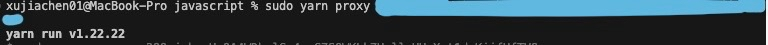

1. 浏览器使用需要添加base url，
2. 需要启动 proxy， 可以在本地package.json 的scripts下面加入： "proxy": "cd bce-qianfan-sdk/javascript/proxyServer && node proxy.js" 运行 命令
或者进入nodemodules里面的千帆sdk下面的javascript里面直接运行命令： npm run proxy -- ak sk。 ak 和sk对应的位置分别输入你的access key 和secret key。
3. proxy启动后，用浏览器打开html文件，刷新，即可在console里面查看返回结果。




```ts
import {ChatCompletion, setEnvVariable} from "@baiducloud/qianfan";

const client = new ChatCompletion({QIANFAN_BASE_URL: 'http://localhost:3001'});

async function main() {
    const resp = await client.chat({
        messages: [
            {
                role: 'user',
                content: '你好！',
            },
        ],
    });
    console.log(resp);
}

main();
```
