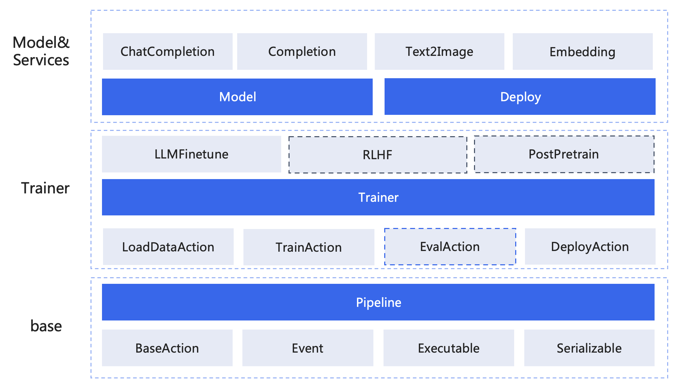

# Trainer

千帆大模型平台提供了数据管理，训练微调，模型管理以及服务部署等多样化的服务接口，这些服务接口设计上大都以原子粒度进行设计，穿插于大模型开发中各个环节之中。
为了让用户更方便快捷的使用这些服务，我们基于自身的实践的使用体验设计了`Trainer`类型以提供更简化的大模型训练的能力。


## 快速开始

### Finetune
以下以LLMFinetune（对应千帆平台 SFT语言大模型）为例，介绍如何使用`Trainer`进行训练。

```python
import os 

os.environ["QIANFAN_ACCESS_KEY"] = "your_ak"
os.environ["QIANFAN_SECRET_KEY"] = "your_sk"

from qianfan.dataset import Dataset
from qianfan.trainer import LLMFinetune

# 加载千帆平台上的数据集
ds: Dataset = Dataset.load(qianfan_dataset_id="111")

# 新建trainer LLMFinetune，最少传入train_type和dataset
# 注意fine-tune任务需要指定的数据集类型要求为有标注的非排序对话数据集。
trainer = LLMFinetune(
    train_type="ERNIE-Speed",
    dataset=ds, 
)

trainer.run()
```

### PostPretrain
除了使用`LLMFinetune`进行模型微调外，我们还可以使用`PostPretrain`:

```python
from qianfan.trainer import PostPreTrain, LLMFinetune
from qianfan.trainer.configs import TrainConfig
from qianfan.trainer.consts import PeftType
from qianfan.dataset import Dataset

# 泛文本 数据集
ds = Dataset.load(qianfan_dataset_id="ds-ag138")

# postpretrain
trainer = PostPreTrain(
    train_type="ERNIE-Speed",
    dataset=ds,
)
trainer.run()
# 这一步可以拿到训练完成的PostPretrain任务信息:
print(trainer.output)


# sft数据集
sft_ds = Dataset.load(qianfan_dataset_id="ds-47j7ztjxfz60wb8x")
ppt_sft_trainer = LLMFinetune(
    train_type="ERNIE-Speed",
    dataset=sft_ds,
    train_config=TrainConfig(
        epoch=1,
        learning_rate=0.00003,
        max_seq_len=4096,
        peft_type=PeftType.ALL,
    ),
    name="qianfantrainer01"
    previous_trainer=trainer,
)

ppt_sft_trainer.run()
# 拿到最终的可用于推理部署的模型：
print(ppt_sft_trainer.output)
```

### 自定义训练参数
如果需要自定义训练参数，可以根据不同的模型传入不同的TrainConfig 以指定训练过程中的参数，需要注意的是不同模型支持的参数不同，具体以API文档为准。
```python
import os 

os.environ["QIANFAN_ACCESS_KEY"] = "your_ak"
os.environ["QIANFAN_SECRET_KEY"] = "your_sk"

from qianfan.dataset import Dataset
from qianfan.trainer import LLMFinetune
from qianfan.trainer.configs import TrainConfig, DatasetConfig, CorpusConfig, CorpusConfigItem
from qianfan.resources.console import consts as console_consts


ds = Dataset.load(qianfan_dataset_id="ds-47j7ztjxfz60wb8x")
trainer = LLMFinetune(
    train_type="ERNIE-Speed-8K",
    dataset=DatasetConfig(
        datasets=[sft_ds],
        eval_split_ratio=20, 
        sampling_rate=0.01,
    ),
    train_config=TrainConfig(
        epochs=1, # 迭代轮次（Epoch），控制训练过程中的迭代轮数。
        batch_size=32, # 批处理大小（BatchSize）表示在每次训练迭代中使用的样本数。较大的批处理大小可以加速训练.
        learning_rate=0.00002, # 学习率（LearningRate）是在梯度下降的过程中更新权重时的超参数，过高会导致模型难以收敛，过低则会导致模型收敛速度过慢，
    ),
    corpus_config=CorpusConfig(
        data_copy=False, # 仅一言语料使用，如果为True，则当语料库不足以混入时，则拷贝重复数据混入
        corpus_configs=[
            # CorpusConfigItem( # 千帆通用语料
            #     corpus_type=console_consts.FinetuneCorpusType.QianfanCommon,
            #     corpus_proportion="1%", # 总通用语料共n条，混入比例的取值范围x%为[0-100]%， 则混入n * x%
            # ),
            CorpusConfigItem( # 一言垂类
                corpus_labels=["文本创作"],
                corpus_type=console_consts.FinetuneCorpusType.YiyanVertical,
                corpus_proportion="1:2", # 1:x 表示一条用户数据对应x条一言语料数据
            ),
            CorpusConfigItem( # 一言通用
                corpus_type=console_consts.FinetuneCorpusType.YiyanCommon,
                corpus_proportion="1:1", # 1:x 表示一条用户数据对应x条一言语料数据
            ),
            
        ],
    )
)
trainer.run()
```

- `train_type`: 训练模型类型
- `dataset`: 训练数据集，支持传入DatasetConfig或Dataset或千帆数据集id
- `data_copy` 是否数据拷贝，如果在配置的混合比例下，需要混合的数据量超出了平台混合数据的总量，默认不重复选择数据训练。如果要重复选择数据，请打开开关。只有一言通用和一言垂直混合方式支持此参数，且两者共用此参数。
- `corpus_labels` 支持以下取值：'主观知识问答','客观知识问答','文本创作','表格问答','信息抽取','指令理解','标题生成','问题生成','示例学习','文本属性分析','摘要','语言推理','阅读理解','文本分类','Json转文本','代码生成','代码纠错','代码解释','理科试题','多轮对话','角色扮演（多轮）','风格定制（多轮）','翻译','文科试题','Agent','NL2SQL'，每一个`CorpusConfigItem` 最多指定5个Labels。


### 事件回调

如果需要在训练过程中监控每个阶段的各个节点的状态，可以通过事件回调函数来实现

```python
import os 

os.environ["QIANFAN_ACCESS_KEY"] = "your_ak"
os.environ["QIANFAN_SECRET_KEY"] = "your_sk"

from qianfan.dataset import Dataset
from qianfan.trainer import LLMFinetune
from qianfan.trainer.configs import TrainConfig
from qianfan.trainer.event import Event, EventHandler
from qianfan.trainer.consts import ActionState

# 定义自己的EventHandler，并实现dispatch方法
class MyEventHandler(EventHandler):

    def dispatch(self, event: Event) -> None:
        print("receive:<", event)
        if event.action_state == ActionState.Error:
            print(f"action {event.action_id} error :{event.data}")

eh = MyEventHandler()
trainer = LLMFinetune(
    train_type="ERNIE-Speed",
    dataset=ds,
    train_config=TrainConfig(
        epochs=1,
        batch_size=1,
        learning_rate=0.00002,
    )
    event_handler=eh,
)
trainer.run()
```